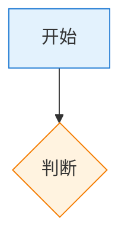

# KnowHowAI 写作本能

## 当撰写文档时

### 触发条件
当需要为知识库创建新文档时

### 行动
1. 确认文档属于哪个分栏（VibeCoding / OpenClaw / 效率工具 / Playground）
2. 检查已有文档序号，分配下一个序号
3. 使用标准文档结构（简介 → 核心理念 → 基础操作 → 进阶 → Q&A → 下一步）
4. 添加 Mermaid 图表增强可读性

### 验证点
- Frontmatter title 使用 `序号-emoji 标题` 格式
- 章节使用 `## 📖 标题` 格式
- 代码块标注语言（bash/typescript/mermaid 等）
- 包含 Q&A 章节
- 包含"下一步"相关链接

---

# 文档结构本能

## 触发条件
当看到需要介绍新工具/概念的文档时

### 行动
选择合适的结构模式：
- **工具类** → 快速入门模式（前提条件 → 安装 → 验证 → 可选操作）
- **概念类** → 深度教程模式（什么是 → 核心理念 → 操作 → 配置 → 对比）
- **技巧类** → Q&A 模式（问题 → 答案）

---

# Mermaid 图表本能

## 触发条件
当需要解释流程或架构时

### 行动
添加 Mermaid flowchart 替代冗长文字说明

### 常用样式

### 颜色语义
- 蓝色系：开始、输入
- 绿色系：成功、完成
- 橙色系：判断、等待
- 灰色系：结束

---

# 链接本能

## 触发条件
当需要引用内部资源时

### 行动
- 同目录其他文档：`[[文档名]]`
- 跨目录文档：`[[分栏名/文档名]]`
- 索引页：`[[分栏名]]`
- 外部链接：标准 Markdown `[文字](URL)`
