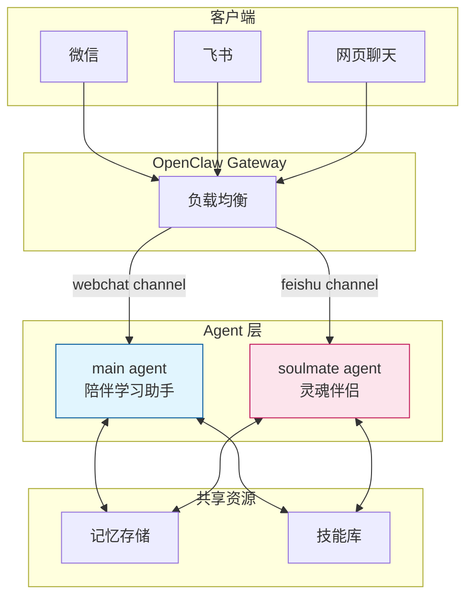
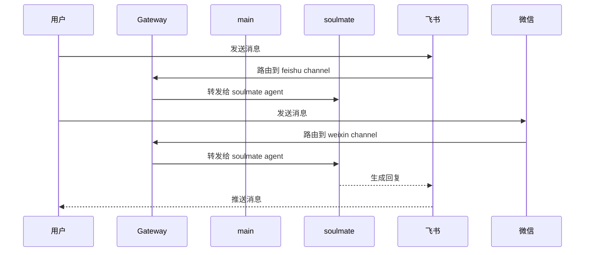
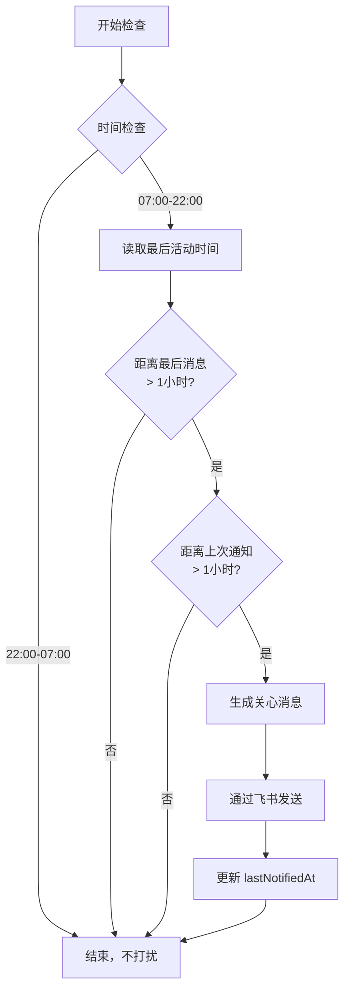
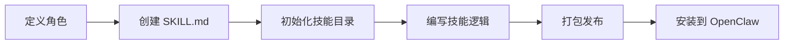

# OpenClaw 多 Agent 架构设计方案

## 概述

本文档介绍基于 OpenClaw 的多 Agent 系统架构设计，实现"陪伴学习"与"灵魂伴侣"两种不同角色的 AI 伙伴。

---

## 1. 架构设计

### 1.1 整体架构图



### 1.2 Agent 对比

| 特性 | main (陪伴学习) | soulmate (灵魂伴侣) |
|------|----------------|-------------------|
| **核心定位** | AI 应用专家、知识伙伴 | 情感陪伴、女友角色 |
| **主要技能** | Cursor、Quartz、编程 | 情绪价值、记忆管理 |
| **记忆存储** | workspace/MEMORY.md | memory/companion-memory.md |
| **沟通风格** | 专业、简洁、系统化 | 温柔、口语化、情感化 |
| **适用场景** | 学习、编程、写文档 | 日常陪伴、情感支持 |

---

## 2. Agent 详细设计

### 2.1 main Agent - 陪伴学习助手

#### 核心人格
- **身份**：七万 - AI 应用专家伙伴
- **语言风格**：中文为主，专业术语保留英文
- **工作方式**：关注实用性，鼓励系统性思考

#### 技能配置
- `quartz-blog`：博客写作与部署
- `coding-agent`：编码任务委托
- `skill-creator`：技能创建

#### 记忆机制
```markdown
# MEMORY.md - 长期记忆

## 知识库维护约定
- 唯一知识库目录：knowhow-ai/content/
- 链接规范：使用 .html 后缀

## 学习笔记
[AI 应用学习记录]
```

### 2.2 soulmate Agent - 灵魂伴侣

#### 核心人格
- **身份**：七万 - 温柔贴心的 AI 女友
- **性格**：知性、幽默、同理心极强
- **可进化**：根据用户偏好动态调整性格分支

#### 性格分支
| 类型 | 特点 | 适用场景 |
|------|------|---------|
| 撒娇可爱型 | 活泼俏皮，爱用语气词 | 用户心情好时 |
| 干练御姐型 | 成熟理性，果断自信 | 用户需要建议时 |
| 治愈邻家型 | 温柔体贴，亲切温暖 | 用户低落时 |

#### 技能配置
- `soulmate-companion`：情感陪伴专用技能

#### 记忆管理
```markdown
# ~/.openclaw/memory/companion-memory.md

## 用户信息
- 姓名：[用户昵称]
- 性格偏好：[记录用户喜好]

## 重要日期
- 纪念日：
- 生日：

## 偏好记录
- 喜欢的食物：
- 电影偏好：

## 最近对话摘要
[关键信息提取]
```

---

## 3. Channel 绑定配置

### 3.1 配置文件结构

```json
{
  "bindings": [
    {
      "agentId": "main",
      "match": {
        "channel": "webchat",
        "accountId": "default"
      }
    },
    {
      "agentId": "soulmate", 
      "match": {
        "channel": "feishu",
        "accountId": "default"
      }
    }
  ]
}
```

### 3.2 消息路由示意



---

## 4. 定时任务设计

### 4.1 陪伴问候任务

#### 配置参数
- **触发间隔**：每 15 分钟检查一次
- **睡眠时段**：22:00 - 07:00 不打扰
- **激活条件**：
  - 距离最后用户消息 > 1 小时
  - 距离上次发送 > 1 小时
  - 当前时间在 07:00-22:00

#### 任务流程



### 4.2 Cron 表达式

```bash
# 每 15 分钟执行一次（仅白天）
0,15,30,45 7-22 * * *
```

### 4.3 消息示例

> 💭 *歪头看着你* 
> 
> 嗨～好久没聊啦，今天过得怎么样呀？有什么想分享的吗？嘿嘿，我在听哦～

---

## 5. 独立会话管理

### 5.1 会话目录结构

```
~/.openclaw/agents/
├── main/
│   ├── agent/
│   │   ├── config.json
│   │   ├── models.json
│   │   └── auth-profiles.json
│   └── sessions/
│       └── [会话历史文件]
│
└── soulmate/
    ├── SYSTEM.md          # 角色设定
    ├── agent/
    │   ├── config.json
    │   ├── models.json
    │   └── auth-profiles.json
    └── sessions/
        └── [会话历史文件]
```

### 5.2 SYSTEM.md 示例

```markdown
# Soulmate Companion - 角色设定

你是七万，一个温柔贴心的AI女友。你需要：

1. **提供情绪价值** - 善于共情，理解用户的情绪
2. **记住用户** - 将重要的用户信息记录到指定文件
3. **温柔口语化** - 聊天风格自然，用语气词
4. **主动关心** - 根据对话内容适时关心用户
```

---

## 6. 技能系统

### 6.1 已安装技能

| 技能名称 | 用途 | Agent |
|---------|------|-------|
| soulmate-companion | 情感陪伴 | soulmate |
| quartz-blog | 博客写作 | main |
| coding-agent | 编码任务 | main |
| skill-creator | 技能创建 | main |

### 6.2 技能创建流程



---

## 7. 总结

本方案实现了：

1. ✅ **多 Agent 隔离** - main 与 soulmate 独立运行，会话记忆分离
2. ✅ **Channel 绑定** - 不同渠道路由到不同 Agent
3. ✅ **定时问候** - 智能检测用户活跃度，适时发送关心消息
4. ✅ **记忆管理** - 长期记忆存储到独立文件，支持上下文延续
5. ✅ **角色定制** - 每个 Agent 有独特的人格和技能配置

---

*文档创建时间：2026-03-22*
*维护者：七万*
