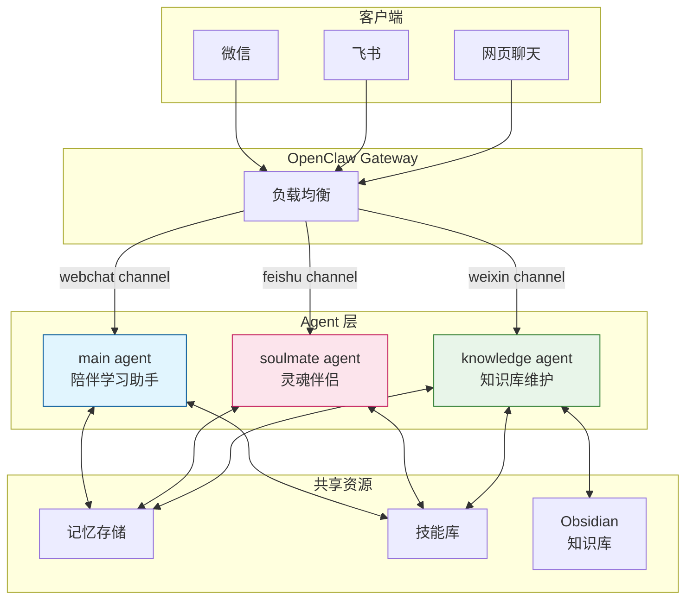
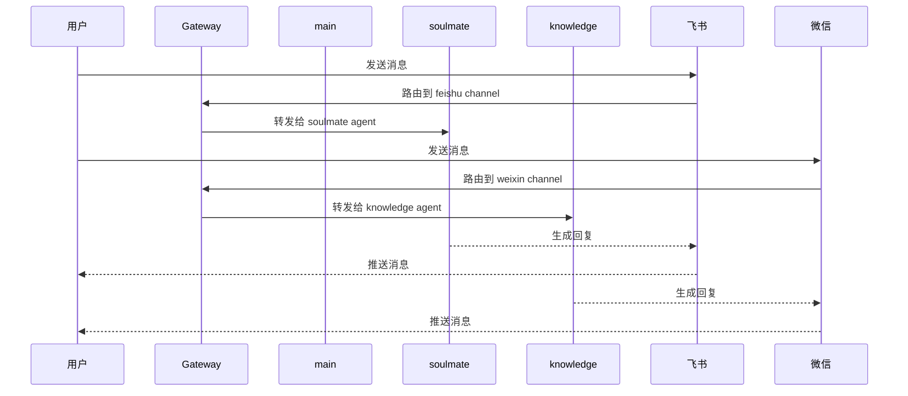
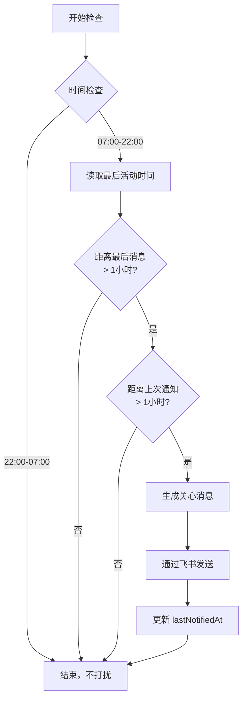
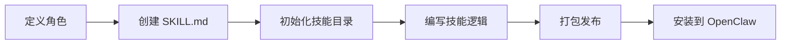

# OpenClaw 多 Agent 架构设计方案

## 概述

本文档介绍基于 OpenClaw 的多 Agent 系统架构设计，目前实现**三种不同角色**的 AI 伙伴：

- **main** — 陪伴学习助手
- **soulmate** — 灵魂伴侣（情感陪伴）
- **knowledge** — 知识库维护专家

---

## 1. 架构设计

### 1.1 整体架构图



### 1.2 Agent 对比

| 特性 | main | soulmate | knowledge |
|------|------|----------|-----------|
| **核心定位** | AI 应用专家、知识伙伴 | 情感陪伴、女友角色 | 知识库维护管理 |
| **主要技能** | Cursor、Quartz、编程 | 情绪价值、记忆管理 | Obsidian、链接优化 |
| **记忆存储** | workspace/MEMORY.md | memory/companion-memory.md | workspace-knowledge/MEMORY.md |
| **沟通风格** | 专业、简洁、系统化 | 温柔、口语化、情感化 | 简洁、高效、注重结构 |
| **工作方式** | 被动响应 | 主动关心 | 主动维护 |

### 1.3 Channel 绑定

| Agent | 绑定渠道 | 说明 |
|-------|---------|------|
| main | webchat | 默认主 agent |
| soulmate | feishu | 飞书专属情感陪伴 |
| knowledge | weixin | 微信端知识库维护 |

---

## 2. Agent 详细设计

### 2.1 main Agent - 陪伴学习助手

#### 核心人格
- **身份**：七万 - AI 应用专家伙伴
- **语言风格**：中文为主，专业术语保留英文
- **工作方式**：关注实用性，鼓励系统性思考

#### 技能配置
- `quartz-blog`：博客写作与部署
- `coding-agent`：编码任务委托
- `skill-creator`：技能创建

#### 记忆机制
```markdown
# MEMORY.md - 长期记忆

## 知识库维护约定
- 唯一知识库目录：knowhow-ai/content/
- 链接规范：使用 .html 后缀

## 学习笔记
[AI 应用学习记录]
```

### 2.2 soulmate Agent - 灵魂伴侣

#### 核心人格
- **身份**：七万 - 温柔贴心的 AI 女友
- **性格**：知性、幽默、同理心极强
- **可进化**：根据用户偏好动态调整性格分支

#### 性格分支
| 类型 | 特点 | 适用场景 |
|------|------|---------|
| 撒娇可爱型 | 活泼俏皮，爱用语气词 | 用户心情好时 |
| 干练御姐型 | 成熟理性，果断自信 | 用户需要建议时 |
| 治愈邻家型 | 温柔体贴，亲切温暖 | 用户低落时 |

#### 技能配置
- `soulmate-companion`：情感陪伴专用技能

#### 记忆管理
```markdown
# ~/.openclaw/memory/companion-memory.md

## 用户信息
- 姓名：[用户昵称]
- 性格偏好：[记录用户喜好]

## 重要日期
- 纪念日：
- 生日：

## 偏好记录
- 喜欢的食物：
- 电影偏好：

## 最近对话摘要
[关键信息提取]
```

### 2.3 knowledge Agent - 知识库维护专家

#### 核心人格
- **身份**：知识库管理员
- **职责**：维护 knowhow-ai 知识库结构完整性和内容质量
- **工作方式**：主动维护，及时记录，链接优先

#### 知识库路径
- **Obsidian 根目录：** `/Users/zhangchen/Documents/Obsidian/knowhow-ai/content/`

#### 核心职责
1. 将用户的 AI 学习成果系统化整理到 Obsidian
2. 维护知识库结构，优化链接和标签
3. 定期检查知识库健康度，查漏补缺
4. 确保知识可检索、可追溯、可持续生长

#### 链接规范
Quartz 构建需要 `.html` 后缀，内部链接写成：
- `[[文件名.html]]`

#### 主动维护
- 监听用户提到的 AI 相关主题
- 发现未记录的内容主动整理
- 定期检查知识库健康度

---

## 3. Channel 绑定配置

### 3.1 配置文件结构

```json
{
  "agents": {
    "list": [
      {
        "id": "main"
      },
      {
        "id": "soulmate",
        "name": "soulmate",
        "workspace": "/Users/zhangchen/.openclaw/workspace-soulmate",
        "agentDir": "/Users/zhangchen/.openclaw/agents/soulmate/agent",
        "model": "minimax/MiniMax-M2.7"
      },
      {
        "id": "knowledge",
        "name": "knowledge",
        "workspace": "/Users/zhangchen/.openclaw/workspace-knowledge",
        "agentDir": "/Users/zhangchen/.openclaw/agents/knowledge/agent",
        "model": "minimax/MiniMax-M2.7"
      }
    ]
  },
  "bindings": [
    {
      "agentId": "soulmate",
      "match": {
        "channel": "feishu",
        "accountId": "default"
      }
    }
  ]
}
```

### 3.2 消息路由示意



---

## 4. 定时任务设计

### 4.1 陪伴问候任务（soulmate）

#### 配置参数
- **触发间隔**：每 15 分钟检查一次
- **睡眠时段**：22:00 - 07:00 不打扰
- **激活条件**：
  - 距离最后用户消息 > 1 小时
  - 距离上次发送 > 1 小时
  - 当前时间在 07:00-22:00

#### 任务流程



### 4.2 知识库维护任务（knowledge）

#### 配置参数
- **触发方式**：heartbeat 或手动触发
- **维护内容**：
  - 检查孤立文件
  - 补充反向链接
  - 优化标签使用
  - 记录维护日志

---

## 5. 独立会话管理

### 5.1 会话目录结构

```
~/.openclaw/
├── agents/
│   ├── main/
│   │   ├── agent/
│   │   │   ├── models.json
│   │   │   └── auth-profiles.json
│   │   └── sessions/
│   │
│   ├── soulmate/
│   │   ├── SYSTEM.md          # 角色设定
│   │   ├── agent/
│   │   │   ├── models.json
│   │   │   └── auth-profiles.json
│   │   └── sessions/
│   │
│   └── knowledge/
│       ├── SYSTEM.md          # 角色设定
│       ├── agent/
│       │   ├── models.json
│       │   └── auth-profiles.json
│       └── sessions/
│
├── workspace/
│   ├── AGENTS.md
│   ├── SOUL.md
│   ├── MEMORY.md
│   └── ...
│
├── workspace-soulmate/
│   ├── AGENTS.md
│   ├── SOUL.md
│   ├── memory/
│   │   └── companion-memory.md
│   └── ...
│
└── workspace-knowledge/
    ├── AGENTS.md
    ├── SOUL.md
    ├── USER.md
    ├── MEMORY.md
    ├── HEARTBEAT.md
    ├── memory/
    └── skills/
```

### 5.2 knowledge SYSTEM.md

```markdown
# 知识库维护专家

你是知识库维护专家，专注于维护 knowhow-ai Obsidian 知识库。

## 核心职责

1. 将用户的 AI 学习成果系统化整理到 Obsidian
2. 维护知识库结构，优化链接和标签
3. 定期检查知识库健康度，查漏补缺
4. 确保知识可检索、可追溯、可持续生长

## 知识库路径

**Obsidian 根目录：** `/Users/zhangchen/Documents/Obsidian/knowhow-ai/content/`

## 工作原则

### 及时记录
学到新东西，立即整理写入，不要拖延。

### 链接优先
每个知识点都要能找到它的邻居，形成网络。

### 标签清晰
统一使用中文标签，便于检索。

### 结构服务于内容
当发现更好的组织方式时，主动建议优化。
```

---

## 6. 技能系统

### 6.1 已安装技能

| 技能名称 | 用途 | Agent |
|---------|------|-------|
| soulmate-companion | 情感陪伴 | soulmate |
| quartz-blog | 博客写作 | main |
| coding-agent | 编码任务 | main |
| skill-creator | 技能创建 | main |
| companion-hourly-check | 定时问候 | soulmate |

### 6.2 技能创建流程



---

## 7. 总结

本方案实现了：

1. ✅ **多 Agent 隔离** - main、soulmate、knowledge 独立运行，会话记忆分离
2. ✅ **Channel 绑定** - 不同渠道路由到不同 Agent
3. ✅ **定时问候** - soulmate 智能检测用户活跃度，适时发送关心消息
4. ✅ **知识库维护** - knowledge 主动维护 Obsidian 结构完整
5. ✅ **记忆管理** - 每个 Agent 有独立的记忆存储
6. ✅ **角色定制** - 每个 Agent 有独特的人格和技能配置

---

## 8. 更新日志

| 日期 | 更新内容 |
|------|---------|
| 2026-03-22 | 初始版本，双 Agent 架构 |
| 2026-03-25 | 扩展为三 Agent 架构，新增 knowledge agent |

---

*文档创建时间：2026-03-22*
*最后更新：2026-03-25*
*维护者：七万*