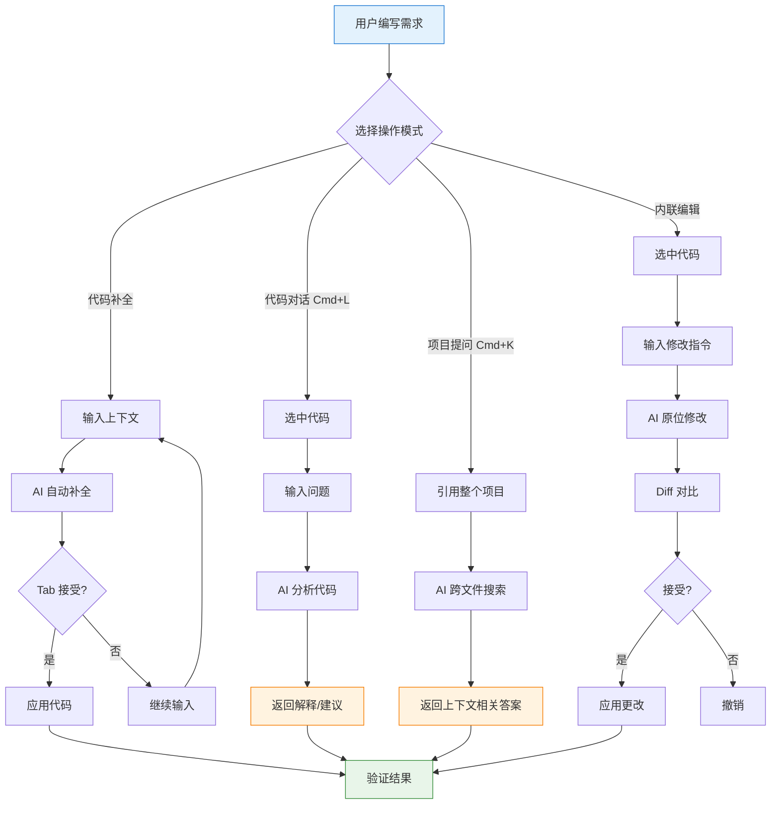

# Cursor入门

## :book: 什么是Cursor？

> Cursor是一个基于VSCode的AI代码编辑器，它不仅仅是"带AI的编辑器"，而是重新思考了"人机协作编程"这个问题的产品。

---

## :bulb: 核心理念

### :arrow_right: AI不是助手，是Co-pilot

> **传统AI工具**是"你问它答"
>
> **Cursor**是"并肩工作"。你负责目标和设计，AI负责细节和实现。

### :mag: 上下文是关键

Cursor的优势在于它能理解**整个项目的上下文**，而不是单个文件。这让它能做出更智能的建议。

### :gear: 可编程的AI

Cursor的Rule、Command、Skills让AI的能力可以被定制和扩展，这是它区别于其他AI工具的核心。

---

## :rocket: 基础操作

### 代码补全
- **自动触发**：输入时AI会智能补全
- **手动触发**：按 `Tab` 接受建议，`Esc` 拒绝

### 代码对话
- 选中代码 → 按 `Cmd+L` (Mac) 或 `Ctrl+L` (Windows/Linux)
- 可以问：解释、优化、测试、重构

### 项目级别提问
- 按 `Cmd+K` / `Ctrl+K` 打开对话框
- 可以引用整个项目，AI会搜索相关代码

### 内联编辑
- 选中代码 → 输入修改指令
- AI会在原位修改，你可以diff对比

---

## :art: AI 协作工作流

---

## :wrench: 配置建议

### 模型选择

| 使用场景 | 推荐模型 | 原因 |
|---------|---------|------|
| 日常开发 | GPT-4 或 Claude 3.5 | 平衡质量和速度 |
| 复杂推理 | GPT-4o 或 Claude 3.5 Sonnet | 更强推理能力 |
| 快速迭代 | GPT-3.5 | 适合简单任务 |

### 上下文窗口

>  Cursor会智能管理上下文，但需要注意：
> - 保持项目结构清晰
> - 避免超大单文件
> - 使用 `.cursorignore` 排除不必要的内容

---

## :chart_with_upwards_trend: 与传统开发模式的对比

| 场景 | 传统模式 | Cursor模式 |
|------|---------|-----------|
| 查API文档 | Google搜索 → 翻文档 | 问AI，直接给示例 |
| 写样板代码 | 手敲或复制粘贴 | AI自动生成 |
| 理解复杂逻辑 | 阅读代码+画图 | 让AI解释+画图 |
| 性能优化 | 手动分析profiler | AI建议+实现 |

---

## :books: 学习路径

| 周数 | 目标 | 内容 |
|------|------|------|
| 第1周 | 入门 | 熟悉基础操作，用AI完成日常任务 |
| 第2周 | 进阶 | 开始使用Rule规范项目AI行为 |
| 第3周 | 精通 | 自定义常用Command提升效率 |
| 第4周+ | 专家 | 探索Skills和Subagent，处理复杂场景 |

---

## :question: 常见问题

### Q: Cursor会泄露我的代码吗？

> 本地模式下代码不上传云端。云端模式的隐私政策需自行确认。

### Q: AI写的代码质量如何？

> 取决于你的描述质量和Rule规范。好的AI需要好的提示和约束。

### Q: 会让我变懒、变笨吗？

> 不会，但会改变工作的重心：从"写代码"变成"设计系统"和"把关质量"。

---

## :arrow_forward: 下一步

- [[Rule系统详解]] - 学习如何让AI按你的意愿工作
- [[Command自定义指南]] - 打造你的专属快捷键
- [[实战案例]] - 看看在真实项目中如何使用

---

## :link: 参考资料

- [Cursor官方文档](https://docs.cursor.sh)
- [Cursor GitHub](https://github.com/getcursor/cursor)
- [[我的学习笔记]]（待补充）
