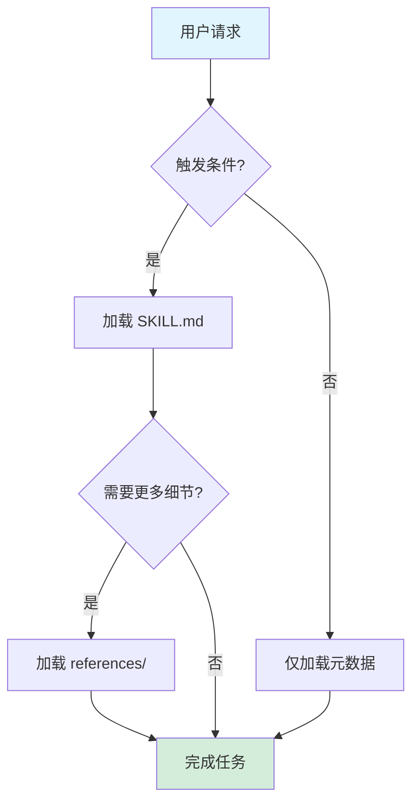
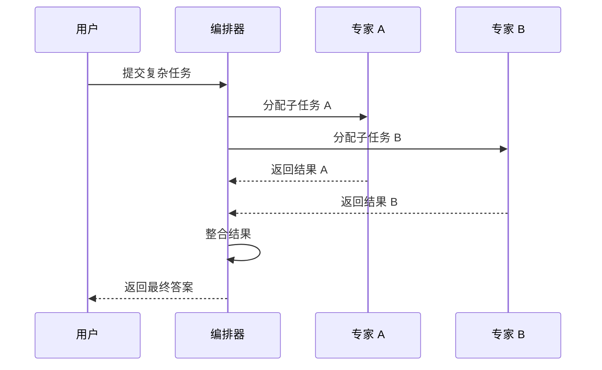
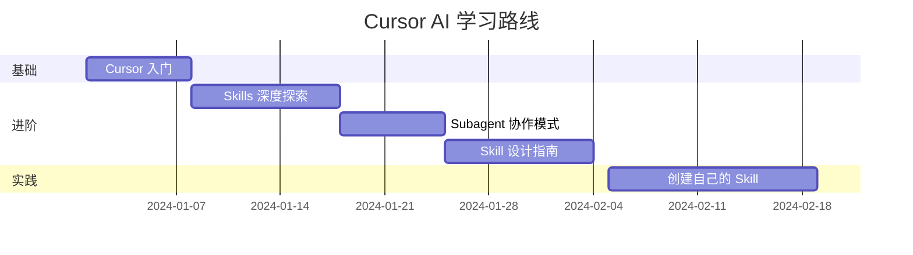
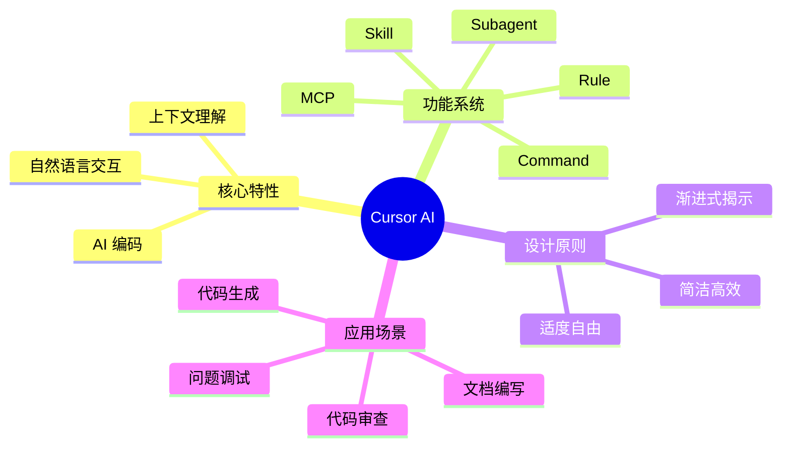
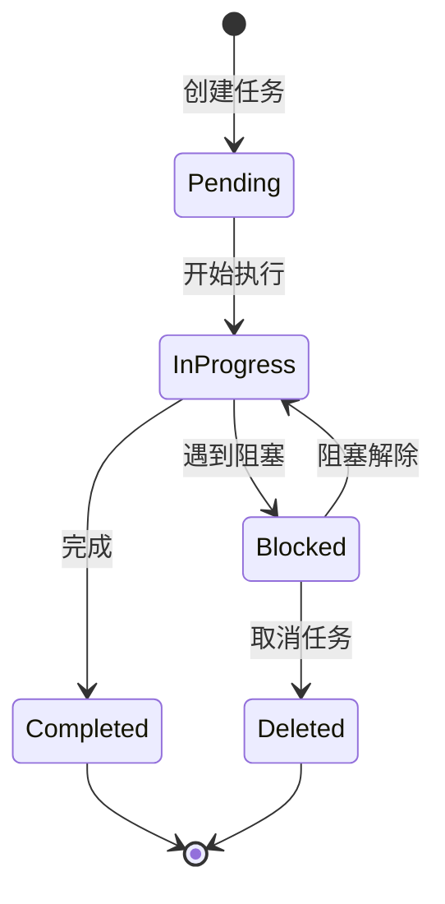
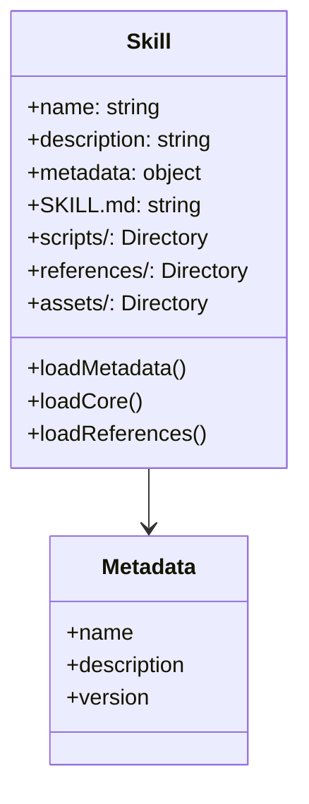

# ✨ Markdown 文档美化演示

本文展示各种 Markdown 美化技巧，让知识讲解更加生动形象。

---

## 1. 标题层级

### 二级标题
#### 三级标题
##### 四级标题

---

## 2. 代码块（语法高亮）

```python
# Python 示例
def calculate_fibonacci(n):
    """计算斐波那契数列"""
    if n <= 1:
        return n
    return calculate_fibonacci(n-1) + calculate_fibonacci(n-2)

# 使用列表推导式
fib_list = [calculate_fibonacci(i) for i in range(10)]
print(fib_list)
```

```javascript
// JavaScript 示例
const fetchData = async (url) => {
  try {
    const response = await fetch(url);
    const data = await response.json();
    return data;
  } catch (error) {
    console.error('请求失败:', error);
  }
};
```

```bash
# Bash 命令示例
git clone https://github.com/user/repo.git
cd repo
npm install
npm run dev
```

---

## 3. 表格

### 技能对比表

| 特性 | MCP | Rule | Command | Skill | Subagent |
|------|-----|------|---------|-------|----------|
| 作用域 | 基础设施 | 项目级 | 会话级 | 项目/用户级 | 任务级 |
| 持久性 | ✅ 持久 | ✅ 持久 | ❌ 临时 | ✅ 持久 | ❌ 临时 |
| 复杂度 | 低 | 低 | 低 | 高 | 高 |
| 典型用途 | 外部 API | 代码规范 | 快捷操作 | 复杂任务 | 多专家协作 |

### 渐进式揭示模式

| 模式 | 适用场景 | 描述 |
|------|----------|------|
| 功能分层 | 多功能模块 | 每个功能链接到独立的参考文件 |
| 领域分离 | 复杂业务域 | 每个领域有专门的参考文档 |
| 难度分层 | 学习路径 | 快速/标准/高级三级 |
| 条件触发 | 动态需求 | 根据特定条件加载 |
| 按需深度 | 可变复杂度 | 用户或 AI 决定所需深度 |

---

## 4. 列表

### 无序列表

- Cursor AI 是一款 AI 编码助手
  - 基于 Claude 模型
  - 支持 VS Code 插件
  - 拥有丰富的技能系统
- 主要功能包括：
  - 代码补全
  - 代码解释
  - 错误修复
  - 重构建议

### 有序列表

1. 创建一个新的 Skill
   1. 运行 `npx skills init my-skill`
   2. 编辑 `SKILL.md` 文件
   3. 添加必要的脚本和参考文件
2. 测试 Skill 功能
3. 发布到 Skills 仓库

### 任务列表

- [x] 安装 obsidian 技能
- [x] 安装 writing-skills 技能
- [ ] 学习 Mermaid 图表
- [ ] 创建自己的 Skill

---

## 5. 引用块

> **提示**：渐进式揭示是 Skill 设计的核心原则。
>
> 根据用户需求动态调整信息加载深度，既能保持简洁，又能提供充分上下文。

> **警告**：避免在 SKILL.md 中超过 500 行代码。将详细信息移至 `references/` 目录。

---

## 6. Mermaid 图表

### 流程图 - Skill 加载流程



### 序列图 - 多 Agent 协作



### 甘特图 - 学习计划



### 思维导图 - Cursor 特性



### 状态图 - 任务流转



### 类图 - Skill 结构



---

## 7. 分隔线

---

***

---

## 8. 徽章/标签

`技术栈`

> [!info] 技术栈
> - JavaScript / TypeScript
> - Python
> - C/C++

> [!tip] 小贴士
> 使用折叠区块可以收纳大量细节，保持主文档整洁。

> [!warning] 注意
> SKILL.md 文件建议控制在 500 行以内。

> [!example] 示例
> 这是一个示例区块，可以展示代码片段或案例。

> [!success] 成功
> 技能安装成功！

> [!failure] 失败
> 网络连接超时，请重试。

---

## 9. 折叠区块

<details>
<summary><strong>📖 点击展开：Cursor 命令列表</strong></summary>

| 命令 | 描述 |
|------|------|
| `@cursor` | 唤起 Cursor 助手 |
| `Ctrl/Cmd + K` | 编辑模式 |
| `Ctrl/Cmd + L` | 对话模式 |
| `Ctrl/Cmd + I` | 搜索代码 |

</details>

<details>
<summary><strong>🔧 点击展开：配置文件示例</strong></summary>

```json
{
  "name": "my-awesome-skill",
  "description": "An awesome skill for Claude Code",
  "version": "1.0.0",
  "agent": {
    "compatible": ["claude-code", "cursor"]
  }
}
```

</details>

---

## 10. 表情符号装饰

### 🎯 学习路径

1. 🏁 **入门** - 了解 Cursor 基础概念
2. 📚 **进阶** - 掌握 Skills 和 Subagent
3. 🚀 **精通** - 创建自己的技能
4. 🎨 **创作** - 分享到社区

### 🛠️ 工具箱

- 📝 写作 - `writing-skills`
- 📊 图表 - `mermaid-diagrams`
- 📦 管理 - Obsidian 集成

---

## 11. 内联样式

一些编辑器支持内联 HTML 样式：

**加粗文字** 和 *斜体文字* 和 ~~删除线~~

==高亮文字==（Obsidian 支持）

<sup>上标</sup> 和 <sub>下标</sub>

---

## 小结

Markdown 美化可以让知识讲解更加直观生动，主要技巧包括：

| 类别 | 技巧 |
|------|------|
| 结构 | 标题层级、分隔线 |
| 代码 | 语法高亮、行号 |
| 数据 | 表格、列表 |
| 视觉 | Mermaid 图表、徽章 |
| 交互 | 折叠区块、任务列表 |

选择合适的技巧，让文档既美观又实用！
