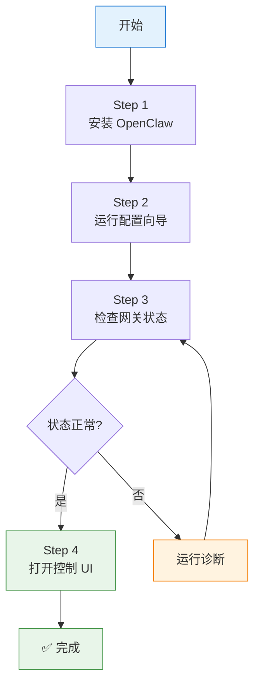

# 🚀 OpenClaw 快速入门

目标：从零开始，快速搭建一个可用的 OpenClaw 网关。

---

## 📋 前提条件

| 要求 | 说明 |
|------|------|
| **Node.js** | 24 (推荐) 或 Node 22 LTS (`22.16+`) |
| **操作系统** | macOS、Linux 或 Windows (推荐 WSL2) |
| **时间** | 5 分钟 |

> 检查 Node 版本：`node --version`

---

## 🔧 快速安装 (4 步)



### Step 1: 安装 OpenClaw

**macOS / Linux / WSL2:**
```bash
curl -fsSL https://openclaw.ai/install.sh | bash
```

**Windows (PowerShell):**
```powershell
iwr -useb https://openclaw.ai/install.ps1 | iex
```

安装脚本会自动：
- 检测并安装 Node.js 24
- 安装 OpenClaw CLI
- 启动配置向导

### Step 2: 运行配置向导

```bash
openclaw onboard --install-daemon
```

向导会帮你配置：
- ✅ API 密钥和认证
- ✅ 网关设置
- ✅ 可选的通道配置

### Step 3: 检查网关状态

```bash
openclaw gateway status
```

### Step 4: 打开控制 UI

```bash
openclaw dashboard
```

或访问：http://127.0.0.1:18789

---

## ✅ 验证成功

> 如果控制 UI 正常加载，说明网关已经就绪！

**现在你可以：**

| 操作 | 说明 |
|------|------|
| 在浏览器中直接和 AI 对话 | http://127.0.0.1:18789 |
| 配置 WhatsApp/Telegram/Discord 等通道 | 参考 [[OpenClaw 飞书插件使用指南]] |
| 从手机/桌面应用发送消息 | 下载对应 App 并配对 |

---

## 🔍 可选操作

### 前台运行网关（调试用）
```bash
openclaw gateway --port 18789
```

### 发送测试消息
```bash
openclaw message send --target +15555550123 --message "Hello from OpenClaw"
```

### 运行诊断
```bash
openclaw doctor  # 检查配置问题
```

---

## 🌐 环境变量

自定义配置/状态目录：

| 变量 | 说明 |
|------|------|
| `OPENCLAW_HOME` | 自定义主目录 |
| `OPENCLAW_STATE_DIR` | 自定义状态目录 |
| `OPENCLAW_CONFIG_PATH` | 自定义配置文件路径 |

---

## 📚 下一步

- [[OpenClaw 安装方法]] - 其他安装方式和详细要求
- [[OpenClaw 配置指南]] - 配置文件详解
- [官方文档 - 配置向导](https://docs.openclaw.ai/start/wizard)

---

*最后更新：{{ lastModified }}*
