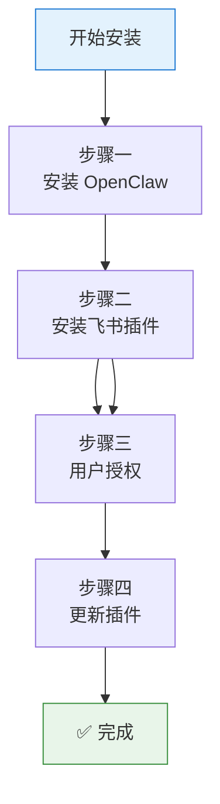

# 🦞 OpenClaw 飞书官方插件使用指南

> 来源：[飞书官方博客](https://www.feishu.cn/content/article/7613711414611463386)
> 更新时间：2026-03-05 | 阅读时间：11 分钟

---

## 📚 目录

1. [[#什么是 OpenClaw]]
2. [[#飞书官方插件能力]]
3. [[#安全与风险提示]]
4. [[#安装步骤]]
5. [[#使用教程]]
6. [[#常见问题]]

---

## 一、什么是 OpenClaw？

**OpenClaw** 是一款开源的个人 AI Agent 系统，可以运行在个人电脑或服务器上。

### 与其他 Agent 的区别

| 特点 | 说明 |
|------|------|
| **完全私有** | 属于你的私人助理 |
| **长期记忆** | 能力持续进化 |
| **高权限** | 能直接操作电脑 |
| **本地运行** | 数据不出本地 |
| **24 小时主动** | 可定时执行任务 |

---

## 二、飞书官方插件能力

### 核心能力

**做你真正的数字分身**：以你的身份完成工作

| 类别 | 能力 |
|------|------|
| 💬 **消息** | 消息读取（群聊/单聊历史、话题回复）、消息发送、消息回复、消息搜索、图片/文件下载 |
| 📄 **文档** | 创建云文档、更新云文档、读取云文档内容 |
| 📊 **多维表格** | 创建/管理多维表格、数据表、字段、记录（增删改查、批量操作、高级筛选）、视图 |
| 📅 **日历日程** | 日历管理、日程管理（创建/查询/修改/删除/搜索）、参会人管理、忙闲查询 |
| ✅ **任务** | 任务管理（创建/查询/更新/完成）、清单管理、子任务、评论 |

### 特色功能

- ✅ 流式输出卡片回复
- ✅ 识别合并转发消息
- ✅ 发表情支持
- ✅ 话题群独立上下文
- ✅ 多任务并行处理

> [!warning]
> 以用户身份发消息需在飞书开放平台额外开通机器人 `im:message.send_as_user` 权限，部分企业（如字节）不支持此操作。

---

## 三、安全与风险提示

### 🔴 核心风险

这个插件通过飞书接口连接了你的工作数据——消息、文档、日历、联系人，AI 能读到的东西理论上就有泄露的可能。

### 📌 操作风险

| 风险 | 说明 | 应对建议 |
|------|------|---------|
| **AI 幻觉** | 可能误解意图或生成不准确内容 | 先预览，再确认 |
| **不可逆操作** | AI 代发消息以你的名义发出 | 避免全自动驾驶 |
| **数据泄露** | 多人使用或公司账号有风险 | 遵守企业数据安全要求 |

### 💡 使用建议

> 🦞 先拿**个人账号**安全地"玩"起来，等后续安全隔离能力更成熟了，再考虑接入真实工作环境。

---

## 四、安装步骤



### 步骤一：安装 OpenClaw

**macOS / Linux:**
```bash
curl -fsSL https://openclaw.ai/install.sh | bash
```

**Windows:**
```powershell
iwr -useb https://openclaw.ai/install.ps1 | iex
```

### 步骤二：安装飞书插件

```bash
npx -y @larksuite/openclaw-lark-tools install
```

**安装过程：**
1. 选择 **新建机器人** 或 **关联已有机器人**
2. 用飞书客户端扫描二维码
3. 点击 **打开机器人**，发送任意消息开始对话

### 步骤三：用户授权

```bash
# 批量完成用户授权
/feishu auth

# 让 AI 学习新技能
学习一下我安装的新飞书插件，列出有哪些能力

# 验证安装成功
/feishu start
```

### 步骤四：更新插件

```bash
# 查看 OpenClaw 版本（要求：Linux/Mac 2026.2.26+，Windows 2026.3.2+）
openclaw -v

# 升级飞书插件
npx -y @larksuite/openclaw-lark-tools update
```

---

## 五、使用教程

### 流式输出配置

```bash
# 开启流式输出
openclaw config set channels.feishu.streaming true

# 关闭流式输出
openclaw config set channels.feishu.streaming false

# 显示耗时和状态
openclaw config set channels.feishu.footer.elapsed true
openclaw config set channels.feishu.footer.status true
```

### 多任务并行

```bash
# 开启话题群独立上下文
openclaw config set channels.feishu.threadSession true

# 关闭
openclaw config set channels.feishu.threadSession false
```

### 群聊回复模式

#### 模式 1：只有 @机器人 才回复（推荐）

```bash
openclaw config set channels.feishu.requireMention true --json
```

#### 模式 2：所有消息都回复

```bash
openclaw config set channels.feishu.requireMention false --json
```

> [!warning]
> 需要申请敏感权限 `im:message.group_msg`，大群容易刷屏，谨慎使用！

#### 模式 3：特定群 @才回复

```bash
# 默认所有群都不需要 @
openclaw config set channels.feishu.requireMention open --json

# 给特定群设置需要 @
openclaw config set channels.feishu.groups.oc_xxxxxxxx.requireMention true --json
```

---

## 六、常见问题

### 诊断命令

```bash
# 确认安装成功
/feishu start

# 检查配置
/feishu doctor

# 批量授权
/feishu auth

# 查看详细诊断
npx @larksuite/openclaw-lark-tools doctor

# 自动修复
npx @larksuite/openclaw-lark-tools doctor --fix

# 查看版本信息
npx @larksuite/openclaw-lark-tools info

# 查看详细配置
npx @larksuite/openclaw-lark-tools info --all
```

### 问题 1：cannot find module xxx

**原因：** 系统没有安装插件依赖

**解决：**
```bash
cd 插件安装目录
npm install
```

### 问题 2：Coze 上安装失败

```bash
export NPM_CONFIG_REGISTRY=https://registry.npmmirror.com
npx -y @larksuite/openclaw-lark-tools install
```

### 问题 3：OpenClaw 3.2 无法调用工具

**原因：** 新版本默认关闭工具权限

**解决：** 在 `openclaw.json` 添加：
```json
{
  "tools": {
    "profile": "full",
    "sessions": {
      "visibility": "all"
    }
  }
}
```

### 问题 4：权限不足

**解决步骤：**

1. 打开 [飞书开放平台](https://open.feishu.cn/app)
2. **开发配置** → **权限管理** → **批量导入/导出权限**
3. 导入所需权限（见下方权限列表）
4. 创建版本 → 确认发布

**所需权限列表：**
```json
{
  "scopes": {
    "tenant": [
      "contact:contact.base:readonly",
      "docx:document:readonly",
      "im:chat:read",
      "im:message:readonly",
      "im:message:send_as_bot",
      "cardkit:card:write"
    ],
    "user": [
      "base:app:create",
      "base:record:create",
      "base:record:read",
      "base:record:update",
      "calendar:calendar.event:create",
      "docs:document:copy",
      "docx:document:create",
      "drive:file:download",
      "drive:file:upload",
      "task:task:write",
      "wiki:node:read"
    ]
  }
}
```

---

## 七、相关资源

### 官方文档

- [OpenClaw 飞书官方插件使用指南（公开版）](https://bytedance.larkoffice.com/docx/MFK7dDFLFoVlOGxWCv5cTXKmnMh)
- [OpenClaw 官方文档](https://docs.openclaw.ai/)
- [[OpenClaw 快速入门]]

### 相关文章

- [一文完全搞懂 OpenClaw 附飞书对接教程](https://www.feishu.cn/content/article/7602519239445974205)
- [OpenClaw Debug 实用指令合集](https://www.feishu.cn/content/article/7613321214802643921)
- [用飞书妙搭一键部署 OpenClaw](https://www.feishu.cn/content/article/7615218249831058381)
- [飞书接入 OpenClaw 的安全防护与治理指南](https://www.feishu.cn/content/article/7615520954977881029)

---

*最后更新：{{ lastModified }}*
