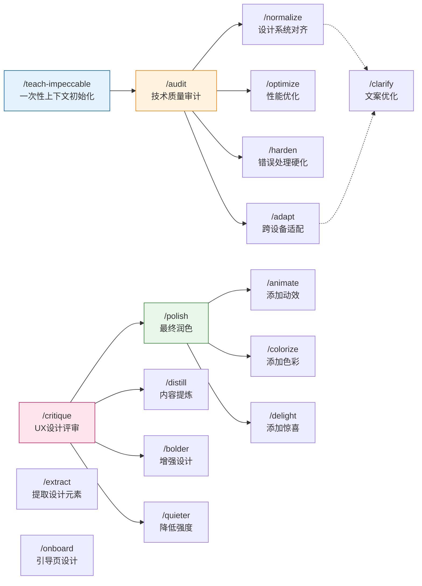

# Impeccable：风格化前端设计技能

> 让 AI 编程工具产出 distinctive、production-grade 的界面设计

## 什么是 Impeccable

**Impeccable** 是一个专为 AI 编程工具设计的**前端设计技能系统**，由 17 个专业化命令组成。它提供：

- 结构化的设计指导
- 精选的设计模式与反模式
- 明确的设计边界规范

其核心目标是：**避免"AI slop"美学**——那些过度使用蓝紫渐变、霓虹效果、圆角卡片、千篇一律的模板化界面。

---

## 核心组成

### 1 个综合技能

一个封装了深度设计专业知识的主技能，包含：
- **Typography 参考** — 字体选择与搭配
- **Color & Contrast 参考** — OKLCH 色彩系统
- **Spatial Design 参考** — 布局节奏与空间
- **Motion Design 参考** — 动效时机与缓动
- **Interaction Design 参考** — 交互模式
- **UX Writing 参考** — 文案规范

### 17 个专业化命令

| 类别 | 命令 | 用途 |
|------|------|------|
| **诊断** | `/audit` | 技术质量审查 |
| | `/critique` | UX 与设计评审 |
| **质量** | `/normalize` | 对齐设计系统 |
| | `/polish` | 最终润色 |
| | `/optimize` | 性能优化 |
| | `/harden` | 错误处理与边界情况 |
| **适配** | `/clarify` | 优化 UX 文案 |
| | `/distill` | 提炼核心内容 |
| | `/adapt` | 适配不同设备/场景 |
| **强度** | `/quieter` | 降低过于激进的设计 |
| | `/bolder` | 增强过于保守的设计 |
| **增强** | `/animate` | 添加动效 |
| | `/colorize` | 添加战略色彩 |
| | `/delight` | 添加个性时刻 |
| **系统** | `/teach-impeccable` | 项目上下文初始化 |
| | `/extract` | 创建设计系统元素 |
| | `/onboard` | 引导页与空状态 |

---

## 命令关系图



---

## 使用流程

### 第一步：初始化项目上下文

```bash
/teach-impeccable
```

这个命令会：
1. 探索代码库，识别 README、package.json、组件、品牌资源等
2. 向你提问关于用户、品牌个性、美学偏好、无障碍需求
3. 生成 `## Design Context` 部分并追加到你的 AI 配置文件

### 第二步：根据场景选择命令

| 场景 | 推荐命令 |
|------|---------|
| 开始新项目 | `/teach-impeccable` → `/normalize` |
| 代码审查 | `/audit` + `/critique` |
| 界面润色 | `/polish` → `/animate` |
| 性能优化 | `/optimize` |
| 添加动效 | `/animate` |
| 色彩调整 | `/colorize` → `/bolder` 或 `/quieter` |
| 引导页设计 | `/onboard` |

### 第三步：组合使用

命令可以串联组合：

```
/audit → /normalize + /clarify → /polish → /animate + /colorize
```

---

## 设计原则

### 必须避免的"AI Slop"

| 反模式 | 说明 |
|--------|------|
| 蓝紫渐变 | 过度使用的 AI 视觉语言 |
| 霓虹效果 | 深色模式下的 glowing accents |
| 圆角卡片网格 | 相同的 icon + heading + text 重复 |
| 居中一切 | 缺乏视觉节奏 |
| 系统字体 | Inter、Roboto、Arial 等 |
| 玻璃拟态滥用 | blur 效果装饰性使用 |
| 弹跳缓动 | 过于动画化 |
| 纯黑/纯白 | 自然界不存在的颜色 |

### 核心设计准则

- **Purposeful** — 每个设计元素都有明确意图
- **Distinctive** — 与 AI 生成的通用模板区分
- **Rhythm** — 通过变化的间距创造视觉节奏
- **Warmth** — 有体温的设计，不是冰冷的界面

---

## 与其他技能的区别

| 技能 | 定位 |
|------|------|
| **frontend-design** | 通用前端设计指导 |
| **impeccable** | AI 编程工具专用，17 个命令驱动 |
| **knowhow-ai-writer** | 文档撰写规范 |

Impeccable 专注于**与 AI 对话式编程时的设计指导**，通过 `/命令` 的方式精确控制 AI 的设计输出。

---

## 下一步

- 尝试在当前项目运行 `/teach-impeccable`
- 使用 `/audit` 审查现有界面
- 使用 `/critique` 获取设计反馈

*文档创建时间：2026-04-04*
