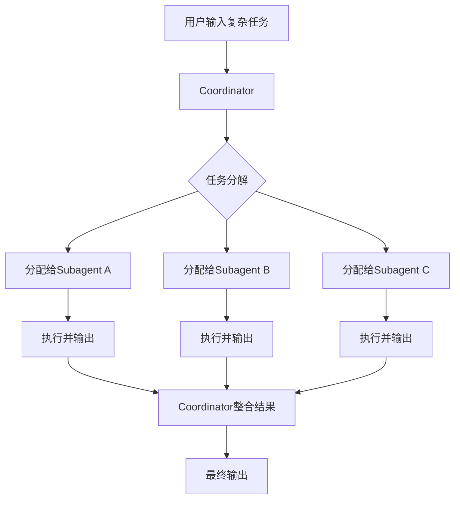

# Subagent协作模式

> Subagent让AI从一个"通才"变成一支"专家团队"，通过多代理协作解决复杂问题。

---

## 什么是Subagent？

### 核心概念
Subagent是Cursor中的"子代理"或"专家代理"系统。它允许你创建多个专门的AI代理，每个代理专注于特定领域或任务，然后让它们协作完成复杂目标。

### 类比：专家团队

**传统模式：**
```
一个通才AI
↓
"帮我设计、实现、测试、优化这个功能"
↓
可能某个环节不深入
```

**Subagent模式：**
```
任务分解
↓
┌─────────┬─────────┬─────────┬─────────┐
│ 架构师  │  程序员  │ 测试员  │  审查员  │
│ 设计方案│ 写代码  │ 测试    │ 审查代码│
└─────────┴─────────┴─────────┴─────────┘
↓
每个环节由专家负责，质量更高
```

---

## 为什么需要Subagent？

### 痛点1：AI的"万能"是个伪命题

一个通才AI什么都懂一点，但可能什么都不精：
- 代码写对了，但性能不够优化
- 功能实现了，但测试不够全面
- 文档写好了，但缺乏架构深度

### 痛点2：复杂任务需要多角度思考

开发一个新功能需要：
1. **需求分析**：理解真实需求
2. **架构设计**：设计模块和接口
3. **代码实现**：写出高质量代码
4. **测试验证**：确保功能正确
5. **性能优化**：提升效率
6. **文档编写**：说明使用方法

让一个AI完成所有环节，容易在某处妥协。

### 痛点3：缺乏"同行评审"

传统模式：
```
AI写代码 → AI审查自己的代码
↓
"我自己写的代码当然没问题啦"
```

Subagent模式：
```
程序员AI写代码 → 审查员AI审查
↓
"这段代码有内存泄漏风险"
```

---

## Subagent的架构

### 基本组成

```
Subagent系统
│
├── Coordinator（协调者）
│   ├── 任务分解
│   ├── 代理分配
│   └── 结果整合
│
├── Subagents（专家代理）
│   ├── Architect（架构师）
│   ├── Developer（开发者）
│   ├── Tester（测试工程师）
│   ├── Reviewer（代码审查员）
│   ├── Optimizer（性能优化师）
│   └── Documenter（文档工程师）
│
└── Shared Context（共享上下文）
    ├── 项目代码
    ├── 规范文档
    └── 协作历史
```

### 工作流程



**实际流程：**
1. **接收任务** - 用户提出复杂需求
2. **任务分解** - Coordinator识别需要的专家
3. **并发执行** - 多个Subagent同时工作
4. **交叉验证** - Subagent之间互相审查
5. **结果整合** - Coordinator汇总输出
6. **质量把关** - Reviewer做最终审查

---

## 如何配置Subagent？

### Subagent定义格式

Cursor使用YAML格式定义Subagent：

```yaml
name: "feature-development-team"
description: "功能开发团队：架构、开发、测试、审查、优化"

coordinator:
  role: "项目经理"
  goal: "协调团队完成功能开发，确保质量和进度"
  max_turns: 10

subagents:
  - name: "architect"
    role: "系统架构师"
    goal: "设计清晰、可扩展、高性能的架构"
    skills:
      - system-design
      - performance-optimization
    context:
      - "docs/architecture.md"
      - "docs/api-guidelines.md"

  - name: "developer"
    role: "C++开发工程师"
    goal: "实现高质量、可维护的代码"
    skills:
      - cpp-coding
      - error-handling
    context:
      - "src/"
      - "docs/coding-standards.md"

  - name: "tester"
    role: "测试工程师"
    goal: "设计全面的测试用例，确保功能正确"
    skills:
      - test-generation
      - test-case-design
    context:
      - "test/"
      - "docs/testing-guidelines.md"

  - name: "reviewer"
    role: "代码审查员"
    goal: "审查代码质量和安全性"
    skills:
      - code-review
      - security-check
    context:
      - "docs/security-guidelines.md"

  - name: "optimizer"
    role: "性能优化师"
    goal: "识别和优化性能瓶颈"
    skills:
      - performance-profiling
      - memory-optimization
    context:
      - "docs/performance-guidelines.md"

  - name: "documenter"
    role: "文档工程师"
    goal: "生成清晰、完整的文档"
    skills:
      - doc-generation
      - api-docs
    context:
      - "docs/template/"
```

### 配置位置

- 项目级：`.cursor/subagents/feature-team.yaml`
- 用户级：`~/.cursor/subagents/`

---

## Subagent的工作模式

### 模式1：流水线式（Pipeline）

**适用场景**：有明确先后顺序的任务

```
需求分析 → 架构设计 → 代码实现 → 测试验证 → 文档编写
```

**特点**：
- 顺序执行，前一步输出作为后一步输入
- 效率高，适合标准化流程
- 缺乏并行能力

**示例**：API功能开发
```yaml
flow: pipeline
steps:
  - agent: architect
    input: "需求描述"
    output: "架构设计文档"

  - agent: developer
    input: "架构设计文档"
    output: "实现代码"

  - agent: tester
    input: "实现代码"
    output: "测试用例和测试代码"

  - agent: documenter
    input: "实现代码 + 架构设计"
    output: "API文档"
```

### 模式2：协作式（Collaborative）

**适用场景**：需要多角度讨论和决策的任务

```
      ┌─────────┐
      │ 用户需求 │
      └────┬────┘
           │
      ┌────▼────┐
      │ Architect │
      └────┬────┘
           │ 设计方案
    ┌──────┼──────┐
    │      │      │
┌───▼──┐ ┌▼────┐ ┌▼──────┐
│ Dev  │ │Test │ │Review │
└───┬──┘ └┬────┘ └┬──────┘
    │     │       │
    └─────┴───────┘
          │
     ┌────▼────┐
     │ 整合输出 │
     └─────────┘
```

**特点**：
- 多个代理并行工作
- 代理之间可以互相讨论
- 质量更高，但效率略低

**示例**：复杂系统设计
```yaml
flow: collaborative
agents:
  - architect:  # 提出方案
      role: "提出初步架构"

  - developer:  # 实现可行性评估
      role: "评估技术可行性"
      feedback_to: architect

  - security_expert:  # 安全性评估
      role: "评估安全性风险"
      feedback_to: architect

  - performance_expert:  # 性能评估
      role: "评估性能影响"
      feedback_to: architect
```

### 模式3：辩论式（Debate）

**适用场景**：需要权衡利弊的决策

```
      ┌─────────┐
      │ 问题输入 │
      └────┬────┘
           │
   ┌───────┴───────┐
   │               │
┌──▼────┐      ┌───▼───┐
│ 方案A │      │ 方案B  │
│ 支持 │      │ 支持  │
└──┬────┘      └───┬───┘
   │               │
   └───────┬───────┘
           │
      ┌────▼────┐
      │  协调者  │
      │ 权衡决策 │
      └────┬────┘
           │
      ┌────▼────┐
      │ 最终方案 │
      └─────────┘
```

**特点**：
- 多个代理提出不同方案
- 互相辩论、指出对方缺陷
- Coordinator权衡利弊做出决策

**示例**：技术选型
```yaml
flow: debate
agents:
  - pro_mysql:
      role: "支持使用MySQL"
      arguments:
        - "成熟稳定"
        - "社区支持好"
        - "团队熟悉"

  - pro_postgresql:
      role: "支持使用PostgreSQL"
      arguments:
        - "功能更强大"
        - "性能更好"
        - "开源协议友好"

  - pro_mongodb:
      role: "支持使用MongoDB"
      arguments:
        - "Schema灵活"
        - "横向扩展好"
        - "适合文档数据"

coordinator:
  decision_criteria:
    - "性能要求"
    - "开发效率"
    - "运维成本"
    - "团队能力"
```

---

## 实战案例：用Subagent开发一个高性能缓存库

### 任务描述
开发一个线程安全的、高性能的LRU缓存库，用于移动端后端服务。

### Subagent配置

```yaml
name: "lru-cache-development-team"
description: "LRU缓存库开发团队"

coordinator:
  role: "技术负责人"
  goal: "协调团队完成高质量缓存库开发"
  max_turns: 15

subagents:
  - name: "architect"
    role: "系统架构师"
    goal: "设计缓存库的整体架构"
    expertise:
      - "数据结构与算法"
      - "并发编程"
      - "性能优化"
    instructions: |
      设计需要考虑：
      1. 线程安全性（锁、无锁、CAS等方案）
      2. LRU淘汰策略的实现（双向链表+哈希表）
      3. 内存管理（对象池、智能指针）
      4. 性能瓶颈分析
      5. 接口设计（易用性、扩展性）

  - name: "developer"
    role: "核心开发"
    goal: "实现缓存库的核心代码"
    expertise:
      - "C++11/14/17"
      - "STL容器和算法"
      - "智能指针和内存管理"
    instructions: |
      代码要求：
      1. 遵循项目编码规范
      2. 使用RAII管理资源
      3. 充分利用移动语义
      4. 添加必要的注释和文档
      5. 考虑异常安全

  - name: "tester"
    role: "测试工程师"
    goal: "设计全面的测试用例"
    expertise:
      - "单元测试"
      - "压力测试"
      - "并发测试"
    instructions: |
      测试需要覆盖：
      1. 基本功能测试（get、put、remove）
      2. LRU淘汰正确性
      3. 并发场景（多线程读写）
      4. 边界情况（容量为0、空缓存、满缓存）
      5. 性能测试（吞吐量、延迟）

  - name: "reviewer"
    role: "代码审查员"
    goal: "审查代码质量和安全性"
    expertise:
      - "代码审查"
      - "安全审计"
      - "最佳实践"
    instructions: |
      审查重点：
      1. 线程安全性验证
      2. 内存泄漏检查
      3. 性能瓶颈识别
      4. 代码可读性和可维护性
      5. 是否遵循C++最佳实践

  - name: "optimizer"
    role: "性能优化师"
    goal: "优化缓存库的性能"
    expertise:
      - "性能分析"
      - "编译优化"
      - "CPU缓存优化"
    instructions: |
      优化方向：
      1. 减少锁竞争（读写锁、分段锁、无锁）
      2. 减少内存分配（对象池、预分配）
      3. CPU缓存友好性（数据布局、内存对齐）
      4. 编译器优化建议

  - name: "documenter"
    role: "文档工程师"
    goal: "生成完整的文档"
    expertise:
      - "技术文档"
      - "API文档"
      - "示例代码"
    instructions: |
      文档包括：
      1. 设计文档（架构、算法、权衡）
      2. API文档（接口说明、参数、返回值）
      3. 使用示例（基本使用、高级用法）
      4. 性能数据（基准测试结果）

workflow:
  - phase: "架构设计"
    agents: [architect]
    output: "architecture_design.md"

  - phase: "核心实现"
    agents: [developer]
    dependencies: ["architecture_design.md"]
    output: "lru_cache.cpp", "lru_cache.h"

  - phase: "代码审查"
    agents: [reviewer]
    dependencies: ["lru_cache.cpp", "lru_cache.h"]
    output: "review_comments.md"

  - phase: "测试开发"
    agents: [tester]
    dependencies: ["lru_cache.cpp", "lru_cache.h"]
    output: "test_lru_cache.cpp"

  - phase: "性能优化"
    agents: [optimizer]
    dependencies: ["lru_cache.cpp", "test_lru_cache.cpp"]
    output: "optimized_lru_cache.cpp", "benchmark_results.md"

  - phase: "文档编写"
    agents: [documenter]
    dependencies: ["optimized_lru_cache.cpp", "architecture_design.md"]
    output: "README.md", "API_REFERENCE.md"
```

### 执行过程

```
用户：帮我开发一个LRU缓存库

Coordinator: 收到任务，分配给Architect

Architect:
  分析需求，设计架构
  考虑并发方案：读写锁 vs 无锁CAS
  选择方案：读写锁 + 双向链表 + 哈希表
  输出：architecture_design.md

Developer:
  根据架构设计实现代码
  使用std::shared_mutex实现读写锁
  使用std::list实现LRU链表
  使用std::unordered_map实现哈希表
  输出：lru_cache.cpp/h

Reviewer:
  审查代码
  发现问题：锁粒度太大
  建议：使用细粒度锁或无锁数据结构
  输出：review_comments.md

Tester:
  根据代码编写测试
  覆盖多线程并发场景
  验证LRU淘汰正确性
  输出：test_lru_cache.cpp

Optimizer:
  分析性能瓶颈
  优化：减少锁持有时间，使用内存池
  运行基准测试
  输出：optimized_lru_cache.cpp + benchmark_results.md

Documenter:
  整合所有信息
  生成完整文档
  输出：README.md + API_REFERENCE.md

Coordinator:
  汇总所有输出
  生成最终交付物
```

---

## Subagent最佳实践

### 1. 角色定义要明确

每个Subagent必须有：
- **明确的职责** - 负责什么，不负责什么
- **清晰的目标** - 要达成什么结果
- **必要的上下文** - 需要知道哪些信息
- **输出格式** - 应该输出什么样的内容

**❌ 不好：**
```yaml
name: "helper"
role: "帮忙的人"
goal: "帮忙做事情"
```

**✅ 好：**
```yaml
name: "cpp-security-auditor"
role: "C++安全审查专家"
goal: "识别C++代码中的安全漏洞"
context:
  - "docs/security-checklist.md"
  - "src/"
output_format: "JSON格式的漏洞报告"
```

### 2. 协调者至关重要

Coordinator是团队的"大脑"，需要：
- **任务分解能力** - 识别需要哪些专家
- **冲突解决能力** - 处理专家之间的分歧
- **质量把关** - 确保最终输出符合要求
- **进度控制** - 避免陷入无限循环

### 3. 合理设置Turns限制

```yaml
coordinator:
  max_turns: 10  # 最大轮次
```

- 太少：可能无法深入讨论
- 太多：浪费Token，可能陷入死循环
- 建议：5-15轮，根据任务复杂度调整

### 4. 共享上下文管理

**好的上下文管理：**
```
共享上下文
├── 项目规范（只读）
├── 架构设计（只读）
└── 协作历史（只读）

私有上下文（各Subagent独有）
├── 审查意见（Reviewer）
├── 测试结果（Tester）
└── 优化建议（Optimizer）
```

### 5. 迭代优化

Subagent配置需要持续优化：

```yaml
version: "2.0"
changelog:
  - "2.0: 添加了Performance Expert角色"
  - "1.5: 优化了Coordinator的冲突解决逻辑"
  - "1.0: 初始版本"
```

---

## Subagent vs 其他模式

| 特性 | Subagent | Skills | 手动对话 |
|------|----------|--------|---------|
| **复杂度** | 最高 | 高 | 低 |
| **质量** | 最高（多专家协作） | 高（专业化） | 中等（依赖用户） |
| **速度** | 较慢（多轮协作） | 快 | 最快 |
| **Token消耗** | 高 | 中 | 低 |
| **适用场景** | 复杂系统 | 专业任务 | 简单问题 |
| **学习曲线** | 陡 | 中 | 平 |

**何时使用Subagent：**
- 开发完整功能（设计+实现+测试+文档）
- 复杂架构设计
- 需要多角度评估的技术决策
- 对质量要求极高的任务

**何时不使用：**
- 简单的代码片段生成
- 快速探索性任务
- Token预算有限

---

## 常见问题

### Q: Subagent和多个Skills有什么区别？
A: Skills是可复用的单个能力，Subagent是多个能力的协作。类比：Skills是"工具"，Subagent是"团队"。

### Q: 如何监控Subagent的执行过程？
A: Cursor会显示每个Subagent的输出和协作过程，可以实时查看和干预。

### Q: Subagent会产生大量Token消耗吗？
A: 是的。建议：
1. 合理设置max_turns
2. 使用共享上下文减少重复加载
3. 重要任务才使用Subagent

### Q: Subagent会互相冲突吗？
A: 会，但这正是价值所在。Coordinator会协调冲突，多角度讨论能产生更好的方案。

---

## 下一步

- [[Skills深度探索]] - 构建可复用的AI能力
- [[实战案例合集]] - 看看Subagent在真实项目中的应用
- [[监控与调试]] - 如何监控Subagent执行过程

---

## 参考资料

- [Cursor Subagent文档](https://docs.cursor.sh/subagents)
- [多代理系统研究论文](https://arxiv.org/abs/2308.10832)
- [[我的Subagent模板库]]（待建立）
