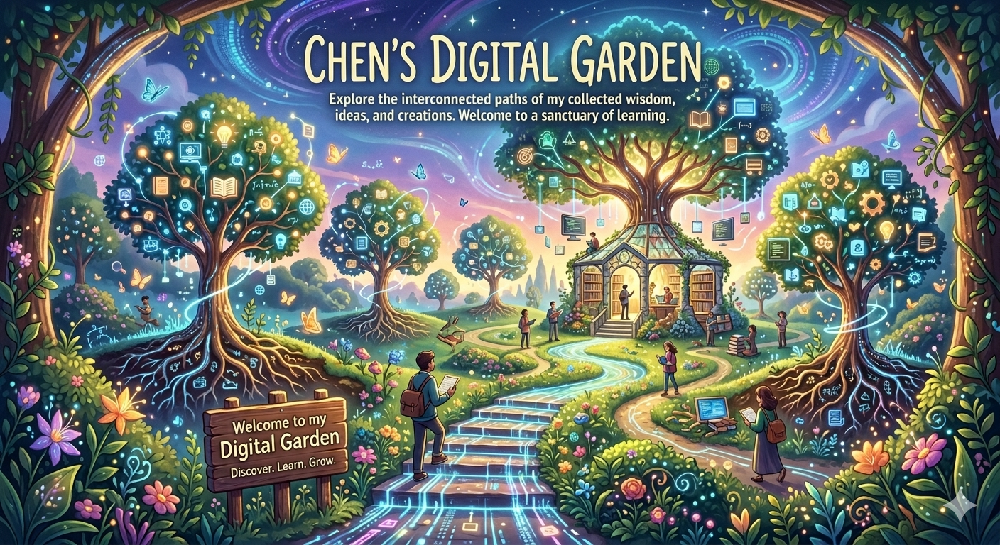

你好，我是晨。

一个在”码农”时代摸爬滚打多年的”上代程序员”。如今进入 vibe coding 时代，也被迫卷入了新一轮的程序员生存淘汰赛。一边还怀念着手磨代码的”触感”，一边正努力驯养着 Cursor、ClaudeCode、OpenClaw 这些 AI 坐骑。

作为这群 AI 助手的”实习牧童”。这里记录的不是什么经验教程，而是一个上一代程序员，在 AI 席卷而来的时代里，努力不被后浪拍在沙滩上的生存实录。持续学习，毕竟再不转型，可能连 AI 随手生成的 Bug 都看不懂了。

# 🧠 KnowHowAI

> **Vibe Coding实战指南 × OpenClaw 实践**  
> 系统化沉淀 AI 应用开发经验，从入门到精通

  <a href="VibeCoding/" class="button primary">💠 探索 Vibe Coding</a>
  <a href="OpenClaw/" class="button secondary">🦞 了解 OpenClaw</a>
   
  <a href="Playground/" class="button secondary">🛝 登陆 Playground</a>
  <a href="效率工具/" class="button secondary">🛠️ 挖掘 Utility</a>

---

  
💡 本知识库持续更新中，欢迎提出建议或分享你的使用经验！

  
最后更新：2026-04-04

