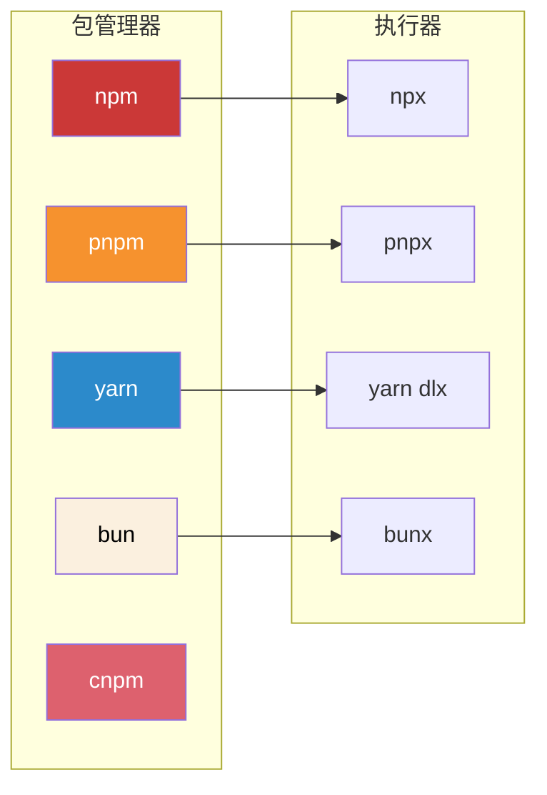
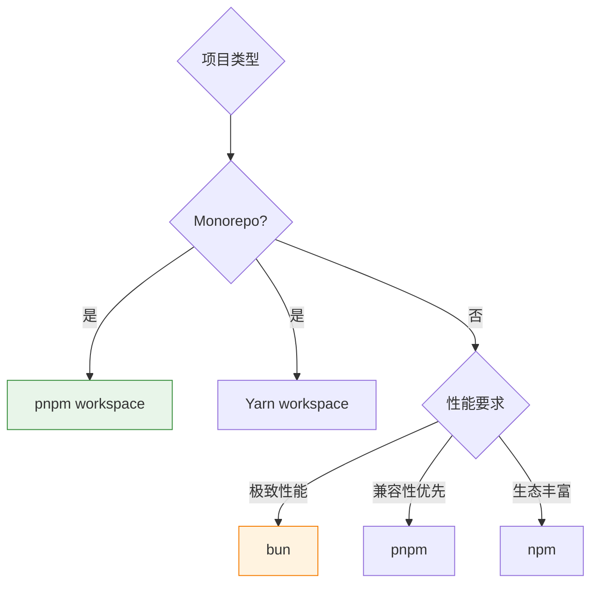

# JavaScript/TypeScript 包管理工具全景

> Node.js 生态中的包管理器对比与实践指南

---

## ⚡ 生态全景



---

## 📊 横向对比

| 特性 | npm | pnpm | yarn | bun | cnpm |
|------|:---:|:----:|:----:|:---:|:----:|
| **作者** | npm Inc. | pnpm | Meta | Oven | cnpm |
| **首发年份** | 2010 | 2016 | 2016 | 2022 | 2016 |
| **安装速度** | 🐌 慢 | 🚀 极快 | 🚀 快 | ⚡ 极速 | 🚀 快 |
| **磁盘占用** | ❌ 高 | ✅ 低 | ❌ 高 | ✅ 低 | ❌ 高 |
| **Node 兼容性** | ✅ | ✅ | ✅ | ✅ | ✅ |
| **Monorepo 支持** | 一般 | ✅ 优秀 | ✅ 优秀 | ✅ | ❌ |
| **Lock 文件** | package-lock.json | pnpm-lock.yaml | yarn.lock | bun.lockb | - |
| **隐私性** | ❌ | ✅ | ✅ | ✅ | ❌ |

---

## 📦 npm

### 概述

Node.js 官方包管理器，生态最大， 包数量最多。

### 常用命令

```bash
# 安装依赖
npm install

# 安装指定包
npm install express
npm install -D typescript        # devDependencies
npm install -g typescript         # 全局安装

# 运行脚本
npm run dev
npm run build

# 包管理
npm update                        # 更新所有包
npm outdated                      # 检查过时包
npm uninstall express             # 卸载
npm ls                            # 列出已安装包
npm ls express                    # 查看指定包

# 搜索
npm search express

# 发布
npm publish                       # 发布到 npm
npm deprecate                     # 弃用警告
```

### npx

npm 自带的执行器，用于运行远程包或本地 `node_modules/.bin` 中的命令。

```bash
# 运行本地安装的工具
npx tsc --version
npx eslint .

# 运行远程包（自动下载临时执行）
npx create-react-app my-app
npx degit user/repo

# 指定版本
npx typescript@5.0.2 tsc --version
```

### 配置文件

`package.json` 中的 `scripts`:

```json
{
  "scripts": {
    "dev": "vite",
    "build": "vite build",
    "preview": "vite preview",
    "lint": "eslint .",
    "test": "vitest"
  }
}
```

---

## ⚡ pnpm

### 概述

采用**内容寻址存储** (Content-addressable storage)，相同包只存储一份，大幅节省磁盘空间。

### 核心优势

```mermaid
flowchart TD
    subgraph npm[传统方式]
        A1[node_modules/project-a] --> A2[lodash@4.17.21]
        B1[node_modules/project-b] --> B2[lodash@4.17.21]
    end

    subgraph pnpm[pnpm 方式]
        C1[.pnpm/store/lodash@4.17.21]
        D1[project-a -> 硬链接] --> C1
        D2[project-b -> 硬链接] --> C1
    end

    style C1 fill:#e8f5e9,stroke:#388e3c
```

### 常用命令

```bash
# 安装
pnpm install

# 常用选项
pnpm add express                  # 安装到 dependencies
pnpm add -D typescript            # devDependencies
pnpm add -g vite                 # 全局安装
pnpm add workspace::express       # monorepo 工作区包

# 其他命令与 npm 类似
pnpm update
pnpm remove express
pnpm list
pnpm run dev
```

### pnpx

pnpm 的执行器，功能与 npx 类似但使用 pnpm 的符号链接机制。

```bash
# 运行本地命令
pnpx tsc --version

# 运行远程包
pnpx create-vite my-app

# 自动使用 pnpm 执行
pnpm dlx create-react-app my-app
```

### workspace 配置

`pnpm-workspace.yaml`:

```yaml
packages:
  - 'packages/*'
  - 'apps/*'
  - 'tools/*'
```

### .npmrc 配置示例

```ini
# 淘宝镜像（国内加速）
registry=https://registry.npmmirror.com

# 安装版本策略
resolution-mode=highest

# 仅允许许可协议
engine-strict=true
```

---

## 🧶 yarn

### 概述

Facebook 推出的包管理器，以离线缓存和确定性安装著称。

### 常用命令

```bash
# 安装
yarn install

# 添加依赖
yarn add express
yarn add -D typescript
yarn add -g vite

# 更新
yarn up                    # 更新所有
yarn up express            # 更新指定包
yarn up "*"                # 更新所有到最新

# 移除
yarn remove express

# 脚本
yarn dev
yarn build

# 其他
yarn list
yarn info express
yarn outdated
```

### yarn dlx

yarn 的包执行器（类似 npx）。

```bash
# 执行远程包
yarn dlx create-vite my-app

# 指定版本
yarn dlx typescript@5.0.2 tsc --version
```

### Yarn Berry (Berry)

Yarn 2.0+ 版本，完全重写，支持 **PnP** (Plug'n'Play) 模式。

```bash
# 升级到 Yarn Berry
yarn set version berry

# 启用 PnP
echo 'nodeLinker: pnp' >> .yarnrc.yml
```

### Yarn PnP 工作原理

```
┌─────────────────────────────────────┐
│           .pnp.cjs                  │
│  (所有包的压缩路径映射)              │
└─────────────────────────────────────┘
          │ require()
          ▼
┌─────────────────────────────────────┐
│         .yarn/cache/                │
│  (所有包的离线压缩包)                │
└─────────────────────────────────────┘
```

---

## 🍎 bun

### 概述

用 Zig 编写的全能运行时，同时是包管理器、安装器和测试运行器。

### 核心优势


### 常用命令

```bash
# 安装（与 npm 完全兼容）
bun install
bun add express
bun add -d typescript

# 运行
bun run dev
bun run build

# 执行单文件
bun run.ts server.ts
bun --watch server.ts     # 监听模式

# 测试
bun test
bun test --coverage

# 构建
bun build ./index.ts --outdir ./dist
```

### bunx

bun 的执行器，比 npx 快数倍。

```bash
# 执行远程包
bunx create-vite my-app

# 执行本地
bunx tsc --version

# 指定版本
bunx typescript@5.0.2 tsc --version
```

### bun.lockb

bun 的锁文件格式（二进制），比 JSON 更快解析。

---

## 🇨🇳 cnpm

### 概述

国内团队维护的 npm 镜像，提供淘宝 npm 镜像服务。

### 常用命令

```bash
# 安装 cnpm CLI
npm install -g cnpm

# 使用淘宝镜像安装
cnpm install express

# 直接通过 npx 使用镜像
npx cnpm install express
```

### 配置镜像

```bash
# 设置淘宝镜像
npm config set registry https://registry.npmmirror.com

# 或在 .npmrc 中
echo 'registry=https://registry.npmmirror.com' >> ~/.npmrc
```

### 国内镜像源对比

| 镜像 | 地址 | 同步频率 |
|------|------|----------|
| 淘宝 | https://registry.npmmirror.com | 10分钟 |
| 腾讯 | https://mirrors.cloud.tencent.com/npm | | 5分钟 |
| 华为 | https://repo.huaweicloud.com/repository/npm | 未知 |

---

## 🔧 Monorepo 场景选择



### pnpm workspace 示例

```yaml
# pnpm-workspace.yaml
packages:
  - 'packages/*'
  - 'apps/*'
```

```json
// apps/web/package.json
{
  "dependencies": {
    "shared-utils": "workspace:*"
  }
}
```

---

## ⚡ 速度基准测试

> 基于相同依赖树的安装测试（来源: pnpm 官方 benchmark）

| 包管理器 | 冷缓存 | 热缓存 |
|----------|:------:|:------:|
| bun | 12s | 2s |
| pnpm | 24s | 4s |
| yarn | 45s | 8s |
| npm | 60s | 15s |

---

## 🎯 场景推荐

| 场景 | 推荐 | 备选 |
|------|------|------|
| 日常项目 | **pnpm** | npm, yarn |
| 极致性能 | **bun** | pnpm |
| 全栈框架集成 | **bun** (Next.js, Remix) | npm |
| 企业内网 | **cnpm** + 私有镜像 | npm |
| 跨平台 CLI | **pnpm** | npm |
| GitHub Actions | **pnpm** | npm, yarn |

---

## 📋 迁移指南

### npm → pnpm

```bash
# 1. 全局安装 pnpm
npm install -g pnpm

# 2. 在项目目录执行
pnpm import          # 从 package-lock.json 生成 pnpm-lock.yaml

# 3. 删除旧文件
rm package-lock.json

# 4. 重新安装
pnpm install
```

### npm/yarn → bun

```bash
# 1. 安装 bun
curl -fsSL https://bun.sh/install | bash

# 2. 迁移 lock 文件
bun pm migrate       # 从 package-lock.json 或 yarn.lock 迁移

# 3. 重新安装
bun install
```

---

## ⚠️ 常见问题

### pnpm 幽灵依赖

```bash
# 问题：pnpm 不会自动提升 node_modules
# 解决：使用虚拟存储目录
pnpm install --shamefully-hoist
```

### yarn PnP 兼容性问题

```bash
# 问题：某些原生模块不支持 PnP
# 解决：禁用 PnP
yarn config set nodeLinker node-modules
```

### bun 兼容性问题

```bash
# 问题：某些 npm 包在 bun 中运行异常
# 解决：报告给 bun 团队，同时可用 --smol 降级
bun --smol run dev
```

---

## 🔗 相关资源

- [npm 官方文档](https://docs.npmjs.com/)
- [pnpm 官方文档](https://pnpm.io/)
- [Yarn 官方文档](https://yarnpkg.com/)
- [Bun 官方文档](https://bun.sh/)
- [cnpm 镜像服务](https://npmmirror.com/)

---

## 📝 实践建议

1. **新项目**: 推荐 pnpm，安装快、磁盘占用低
2. **中国用户**: 使用 npmmirror.com 镜像加速
3. **学习前端**: 熟练使用 npm + npx，了解 package.json 结构
4. **生产项目**: pnpm 或 bun，获得更好的性能和确定性

> **记住**：包管理器只是工具，选择适合自己的即可，但理解它们之间的差异很重要。
