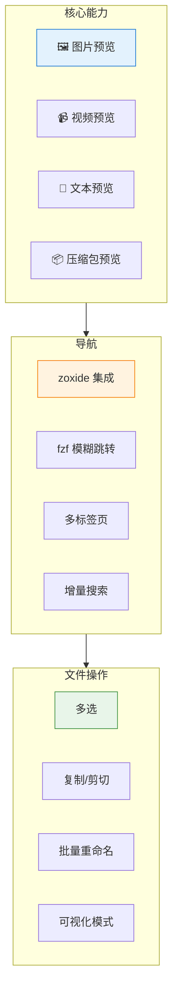

# yazi - 极速终端文件管理器

> 💥 用 Rust 编写的极速终端文件管理器，基于异步 I/O

---

## ⚡ 概览

| 属性 | 值 |
|------|-----|
| **名称** | yazi（意为"鸭子"） |
| **语言** | Rust |
| **Stars** | ~36k |
| **许可** | MIT |
| **特点** | 异步 I/O、丰富预览、插件支持 |

---

## 🔥 核心特性



### 丰富预览

- **图片**: 内联预览图片（ITerm2 / Kitty / Sixel）
- **视频**: 视频文件预览、缩略图
- **文本**: 代码高亮、Markdown 渲染
- **PDF**: 页面预览
- **压缩包**: tar.gz、zip、rar 等

### 高效导航

- **Vim 风格**: hjkl 键位
- **多标签页**: 像浏览器一样管理多个目录
- **fzf 集成**: 模糊搜索跳转
- **zoxide 集成**: 智能目录跳转
- **增量查找**: 实时显示匹配结果

### 强大操作

- **多选**: 支持单独选择、范围选择、可视模式
- **批量重命名**: 正则替换、序号递增
- **任务系统**: 异步任务调度，实时进度报告
- **撤销/重做**: 后悔药支持

---

## 📦 安装

### macOS

```bash
brew install yazi
```

### Linux

```bash
# 通过 cargo 安装
cargo install yazi

# 或通过 yay (Arch)
yay -S yazi

# 或下载预编译二进制
curl -fsSL https://github.com/sxyazi/yazi/releases/latest/download/yazi-x86_64-unknown-linux-musl.tar.gz | tar xz
sudo mv yazi /usr/local/bin/
```

### Windows

```powershell
# via scoop
scoop install yazi

# via cargo
cargo install yazi
```

### 依赖项（可选，用于预览）

```bash
# Ubuntu/Debian
sudo apt install ffmpeg thumbnailer poppler-utils unzip

# Arch Linux
sudo pacman -S ffmpeg imagemagick poppler unzip

# macOS (brew 依赖自动安装)
brew install ffmpeg imagemagick poppler unzip
```

---

## ⌨️ 键位速查

### 导航

| 键 | 功能 |
|----|------|
| `h` / `←` | 返回上级目录 |
| `l` / `→` | 进入目录 / 打开文件 |
| `j` / `↓` | 下移 |
| `k` / `↑` | 上移 |
| `gg` | 跳到顶部 |
| `G` | 跳到底部 |
| `Ctrl+d` | 向下半屏 |
| `Ctrl+u` | 向上半屏 |

### 文件操作

| 键 | 功能 |
|----|------|
| `Space` | 选中/取消选中文件 |
| `v` | 进入可视化模式（范围选择） |
| `yy` | 复制 |
| `dd` | 剪切 |
| `pp` | 粘贴 |
| `dD` | 删除（到回收站） |
| `r` | 重命名 |
| `Enter` | 确认/重命名 |

### 搜索与跳转

| 键 | 功能 |
|----|------|
| `/` | 增量搜索 |
| `n` | 下一个搜索结果 |
| `N` | 上一个搜索结果 |
| `Ctrl+f` | 模糊搜索（fzf） |
| `Ctrl+z` | zoxide 跳转 |

### 标签页

| 键 | 功能 |
|----|------|
| `t` | 新建标签页 |
| `x` | 关闭当前标签页 |
| `1-9` | 切换到第 N 个标签页 |
| `Tab` | 下一个标签页 |
| `Shift+Tab` | 上一个标签页 |

### 其他

| 键 | 功能 |
|----|------|
| `:` | 进入命令模式 |
| `?` | 帮助 |
| `i` | 切换预览模式 |
| `o` | 用系统默认应用打开 |
| `O` | 用...菜单打开 |
| `q` | 退出 |

---

## ⚙️ 配置

### 配置文件结构

```
~/.config/yazi/
├── init.lua          # 初始化配置
├── yazi.toml         # 主配置
├── keymap.toml       # 键位配置
└── plugins/          # 插件目录
    ├── foo.yazi/
    └── bar.yazi/
```

### yazi.toml 示例

```toml
[manager]
show_hidden = true           # 显示隐藏文件
scroll_height = 2            # 滚动边距
tabless = false              # 无标签页模式
info_height = 10             # 底部信息栏高度

[preview]
preview_width = 800          # 预览宽度
max_width = 600              # 最大宽度
image_preview = true         # 图片预览
video_preview = true         # 视频预览

[mouse]
click = true                 # 启用鼠标点击
scroll = true                # 启用鼠标滚动
```

### keymap.toml 示例

```toml
[mgr]
# 基础导航
L = "open"
H = "back"
K = "half_up"
J = "half_down"

# 文件操作
yy = "yank"
p = "paste"
dd = "cut"
dD = "delete"

# 搜索
"/" = "search"
n = "search_next"
N = "search_previous"

# 标签页
t = "tab_new"
x = "tab_close"
```

### init.lua 示例

```lua
-- ~/.config/yazi/init.lua

-- 设置警告级别
require("yazi warn"):setup()

-- 自定义别名
require("yazi alias"):setup({
    alias_cd = "cd",
    alias_ll = "la",
})
```

---

## 🔌 插件系统

yazi 支持 Lua 插件扩展功能。

### 官方插件

| 插件 | 功能 |
|------|------|
| yazi-default-plugins | 预设插件集合 |
| yazi-plugin-airm | Air Media Remote |
| yazi-plugin-art | ASCII Art 渲染 |
| yazi-plugin-codefiles | 代码文件计数 |
| yazi-plugin-fzf | fzf 集成 |
| yazi-plugin-gitignore | 生成 .gitignore |

### 插件安装

```bash
# 克隆到插件目录
git clone https://github.com/yazi-rs/plugins/yazi-plugin-fzf.git \
  ~/.config/yazi/plugins/fzf.yazi
```

### 插件配置

```lua
-- ~/.config/yazi/init.lua
require("fzf"):setup()
```

---

## 📊 性能对比

> 测试环境：包含 100,000 个文件的目录

| 文件管理器 | 启动时间 | 目录切换 |
|------------|:--------:|:--------:|
| **yazi** | 15ms | 5ms |
| ranger | 120ms | 45ms |
| vifm | 80ms | 30ms |
| nnn | 25ms | 12ms |

---

## 🔗 集成配置

### Neovim 集成

```lua
-- lazy.nvim 示例
{
    "yazi-rs/yazi.nvim",
    event = "VeryLazy",
    ft = "yazi",
    opts = {},
    config = function()
        require("yazi").setup()
    end,
}
```

### zsh 集成

```bash
# 在 .zshrc 中添加
function yazi_cd
  yazi --cwd-only $argv[1]
  local target="$(yazi --cwd-only $argv[1])"
  [ -n "$target" ] && z - "$target"
end

alias y = "yazi_cd"
bindkey -s "^f" "yazi_cd\n"
```

### fish 集成

```fish
# 在 config.fish 中添加
function yazi_cd
    set -l target (yazi --cwd-only $argv)
    [ -n "$target" ]; and z $target
end
```

---

## 🆚 竞品对比

| 特性 | yazi | ranger | nnn | lf |
|------|:----:|:------:|:---:|:--:|
| **语言** | Rust | Python | C | Go |
| **启动速度** | ⚡极速 | 🐌 慢 | ⚡快 | ⚡快 |
| **异步 I/O** | ✅ | ❌ | ❌ | ❌ |
| **Vim 风格** | ✅ | ✅ | ⚠️ | ✅ |
| **图片预览** | ✅ | ❌ | ❌ | ❌ |
| **多标签页** | ✅ | ❌ | ❌ | ❌ |
| **插件系统** | ✅ Lua | ✅ Python | ❌ | ❌ |
| **TUI 框架** | Ratatui | ncurses | ncurses | bubbletea |

---

## 💡 使用场景

| 场景 | 适用性 | 说明 |
|------|:------:|------|
| 终端日常文件管理 | ✅ | 替代 cd + ls 组合 |
| 代码仓库导航 | ✅ | 与 zoxide/fzf 完美配合 |
| 远程服务器文件操作 | ✅ | 轻量快速 |
| 图片/视频管理 | ✅ | 内联预览 |
| 学习 Vim 操作 | ✅ | hjkl 导航 |

---

## ⚠️ 常见问题

### Q: 图片预览不工作？

确保使用支持的终端：
- iTerm2 (内置支持)
- Kitty
- Sixel 兼容终端

```toml
# 在 yazi.toml 中启用
[preview]
image_preview = true
```

### Q: 视频预览显示为空白？

需要安装 ffmpeg：

```bash
# macOS
brew install ffmpeg

# Ubuntu
sudo apt install ffmpeg
```

### Q: 插件加载失败？

检查 `init.lua` 语法：

```bash
# 检查语法
lua -c ~/.config/yazi/init.lua
```

### Q: 中文文件名显示乱码？

确保终端编码为 UTF-8：

```bash
export LANG=en_US.UTF-8
```

---

## 🔗 相关资源

- [GitHub 仓库](https://github.com/sxyazi/yazi)
- [官方文档](https://yazi-rs.github.io/)
- [官方特性列表](https://yazi-rs.github.io/features/)
- [插件开发指南](https://yazi-re.github.io/docs/plugins/overview/)
- [键位配置文档](https://yazi-rs.github.io/docs/configuration/keymap/)

---

## 🚀 快速上手

```bash
# 1. 安装 yazi
brew install yazi

# 2. 启动（使用 hjkl 导航）
yazi

# 3. 试试基本操作
l        # 进入目录
h        # 返回上级
Space    # 选中文件
yy       # 复制
p        # 粘贴

# 4. 搜索
/文件名    # 增量搜索
n         # 下一个

# 5. 退出
q
```

> **提示**: 按 `?` 查看完整帮助，按 `:` 进入命令模式输入更多命令。
