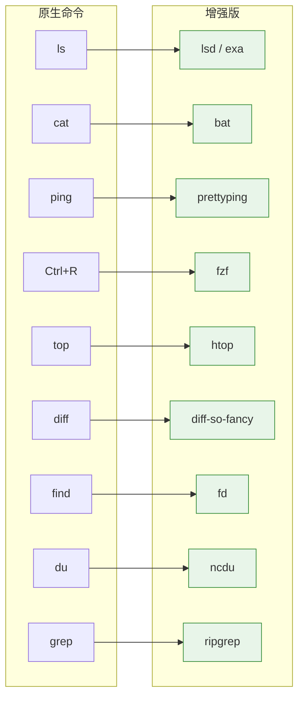

# 命令行增强工具全景

> 经典命令的增强版，让终端效率倍增

---

## ⚡ 概述

本文整理自 [3mile 的博客](https://3mile.github.io/archives/2020/0408005420/)，原文翻译自 Hacker News 上的 [CLI improved](https://github.com/Leonat/CLI-improved) 项目。

**核心思想**: 用增强版工具替换原有命令，通过 alias 无缝迁移，原版工具通过 `\command` 调用。

```bash
\cat                    # 忽略 alias，直接使用原版 cat
command cat             # 忽略函数和 alias
```

---

## 🛠️ 工具对照表



---

## 📊 工具速查

| 原命令 | 增强版 | 功能 | 推荐指数 |
|--------|--------|------|:--------:|
| `ls` | **lsd** / exa | 彩色输出、图标 | ⭐⭐⭐⭐⭐ |
| `cat` | **bat** | 代码高亮、行号 | ⭐⭐⭐⭐⭐ |
| `ping` | **prettyping** | 彩色实时显示 | ⭐⭐⭐ |
| `Ctrl+R` | **fzf** | 模糊搜索历史 | ⭐⭐⭐⭐⭐ |
| `top` | **htop** | 进程管理 | ⭐⭐⭐⭐ |
| `diff` | **diff-so-fancy** | 高亮 diff | ⭐⭐⭐⭐ |
| `find` | **fd** | 简单语法、高亮 | ⭐⭐⭐⭐⭐ |
| `du` | **ncdu** | 可视化磁盘分析 | ⭐⭐⭐⭐ |
| `grep` | **ripgrep** | 超快搜索 | ⭐⭐⭐⭐⭐ |
| `cd` | **zoxide** / enhancd | 智能跳转 | ⭐⭐⭐⭐⭐ |
| - | **jq** | JSON 处理 | ⭐⭐⭐⭐⭐ |
| - | **fpp** | 路径快速打开 | ⭐⭐⭐⭐ |

---

## 🎨 zsh 主题增强

### Powerlevel10k

Powerlevel9k 的高性能 fork，定制化程度极高。

**特点**:
- 性能大幅提升
- 可定制前缀、后缀、目录格式、形状
- 配置向导 (wizard) 快速生成主题
- 可复刻其他经典主题

**安装**:

```bash
# 使用 brew 安装
brew install romkatv/powerlevel10k/powerlevel10k

# 在 .zshrc 添加
echo 'source /opt/homebrew/opt/powerlevel10k/powerlevel10k.zsh-theme' >> ~/.zshrc
```

**配置**:

```bash
# 启动配置向导
p10k configure
```

---

## 📁 lsd — 豪华版 ls

> Rust 编写，彩色输出 + 文件图标

```bash
# 安装
brew install lsd

# 使用
lsd -la
lsd --tree
```

**示例输出**:

```
📁 projects
├── 📄 README.md
├── 📁 src
│   ├── 📄 index.ts
│   └── 📄 app.ts
└── 📄 package.json
```

**推荐别名**:

```bash
alias ll='lsd -la'
alias lt='lsd --tree'
```

**同类工具**:

- **exa**: 另一个流行的 Rust ls 替代品
- **colorls**: Ruby 编写，需要额外依赖

---

## 📝 bat — 有颜色的 cat

> cat 的增强版，支持语法高亮、Git 集成、行号

```bash
# 安装
brew install bat

# 使用
bat file.md
bat -n file.ts    # 显示行号
bat --diff file.md  # 显示 Git diff
```

**特点**:
- 支持所有主流语言语法高亮
- Git 集成 (显示 + / - 行)
- 类似 less 的搜索功能
- 自动分页

**推荐别名**:

```bash
alias cat='bat'
```

---

## 📡 prettyping — 彩色 ping

> 让 ping 输出实时可视化

```bash
# 安装
brew install prettyping

# 使用
prettyping 8.8.8.8
```

**效果**: 彩色实时柱状图显示延迟，无需记忆参数。

---

## 🔍 fzf — 模糊搜索神器

> 模糊查找文件、命令历史

**安装**:

```bash
brew install fzf
$(brew --prefix)/opt/fzf/install
```

**核心用法**:

```bash
# 搜索命令历史 (替换 Ctrl+R)
eval "$(fzf --zsh)"

# 快速打开文件
vim $(fzf)

# 预览选择
fzf --preview 'cat {}'
```

**配合 zoxide**:

```bash
# 在 .zshrc 中添加
eval "$(zoxide init zsh)"
alias z='zoxide_jump'
# 或使用 fzf 选择
unalias z
z() {
    cd "$(zoxide query --interactive)" || return
}
```

---

## 🔄 htop — 增强版 top

```bash
# 安装
brew install htop

# 使用
sudo htop
```

**常用快捷键**:

| 键 | 功能 |
|----|------|
| `P` | 按 CPU 排序 |
| `M` | 按内存排序 |
| `T` | 树形显示 |
| `k` | Kill 进程 |
| `t` | 切换表头 |
| `q` | 退出 |

---

## 🎨 diff-so-fancy — 高亮 diff

```bash
# 安装
brew install diff-so-fancy

# 使用
git diff --color=never | diff-so-fancy

# 配置 Git 全局使用
git config --global core.pager "diff-so-fancy | --color"
git config --global color.diff-so-fancy true
```

**效果**: GitHub 风格的 diff 高亮。

---

## 🔎 fd — 简单好用的 find

> Rust 编写，语法简洁、输出美观

```bash
# 安装
brew install fd

# 使用
fd pattern              # 搜索当前目录
fd -H pattern           # 包含隐藏文件
fd -e md pattern        # 只搜索 .md 文件
fd --type d pattern     # 只搜索目录
```

**对比 find**:

```bash
# find 语法复杂
find . -name "*.md" -type f

# fd 简洁直观
fd -e md -t f
```

---

## 📊 ncdu — 可视化磁盘分析

```bash
# 安装
brew install ncdu

# 使用
ncdu                    # 分析当前目录
ncdu /home             # 分析指定目录
```

**推荐别名** (来自原文):

```bash
alias du="ncdu --color dark -rr -x --exclude .git --exclude node_modules"
```

---

## 🔍 ripgrep (rg) — 超快 grep

> Rust 编写，比 grep 快 10-100 倍

```bash
# 安装
brew install ripgrep

# 使用
rg pattern              # 搜索
rg -i pattern          # 忽略大小写
rg -g "*.md" pattern  # 只搜索 md 文件
rg --files | rg pattern  # 先找文件再搜索
```

**特点**:
- 智能大小写
- 自动忽略 .gitignore 文件
- 支持正则
- 多线程快速搜索

---

## 💎 jq — JSON 命令行处理器

```bash
# 安装
brew install jq

# 使用
cat data.json | jq '.'              # 格式化输出
cat data.json | jq '.key'           # 提取字段
cat data.json | jq '.items[]'       # 数组展开
cat data.json | jq 'map(select(.age > 20))'  # 过滤
```

**特点**:
- 替代复杂的 sed/awk/grep 组合
- 语法类似 JMESPath
- 官方教程简单易学

**同类工具**:

- **csvkit**: 处理 CSV 文件

---

## 🚀 z — 智能目录跳转

> 与 [[zoxide]] 功能类似，根据访问历史 fuzzy 跳转

**安装**:

```bash
# 安装
brew install z

# 在 .zshrc 添加
. /usr/local/etc/profile.d/z.sh
```

**使用**:

```bash
z pattern        # 跳转到匹配目录
z -i pattern    # 交互式选择
```

> 如果使用 zoxide，可以跳过此工具。两者功能重叠，zoxide 性能更好且跨平台。

---

## 📂 fpp — 路径快速打开

> 从管道输入中识别文件路径，一键打开

```bash
# 安装
brew install fpp

# 使用
git status | fpp        # 从 git status 打开文件
ls -la | fpp           # 从列表中选择文件
grep -r "pattern" . | fpp  # 从搜索结果打开
```

**典型场景**: 在终端看到文件路径，用快捷键直接用 vim/VS Code 打开。

---

## 🔧 一键安装脚本

```bash
#!/bin/bash
# 命令行增强工具一键安装 (macOS)

brew install \
    zsh \
    romkatv/powerlevel10k/powerlevel10k \
    lsd \
    bat \
    prettyping \
    fzf \
    htop \
    diff-so-fancy \
    fd \
    ncdu \
    ripgrep \
    jq \
    fpp \
    exa \
    zoxide

# 安装 fzf shell 集成
$(brew --prefix)/opt/fzf/install

echo "✅ 安装完成！请重新加载终端配置"
```

---

## 📋 推荐的 alias 配置

```bash
# ~/.zshrc 或 ~/.bashrc

# ls 系列
alias ll='lsd -la'
alias lt='lsd --tree'
alias ls='lsd'

# cat -> bat
alias cat='bat'

# find -> fd
alias find='fd'

# grep -> rg
alias grep='rg'

# du -> ncdu
alias du='ncdu --color dark -rr -x --exclude .git --exclude node_modules'

# git diff
alias diff='diff-so-fancy'
```

---

## 🔗 相关资源

- [CLI improved 原项目](https://github.com/Leonat/CLI-improved)
- [3mile 博客原文](https://3mile.github.io/archives/2020/0408005420/)
- [lsd GitHub](https://github.com/Peltoche/lsd)
- [bat GitHub](https://github.com/sharkdp/bat)
- [fzf GitHub](https://github.com/junegunn/fzf)
- [ripgrep GitHub](https://github.com/BurntSushi/ripgrep)
- [fd GitHub](https://github.com/sharkdp/fd)
- [Powerlevel10k GitHub](https://github.com/romkatv/powerlevel10k)

---

## 💡 使用建议

1. **渐进替换**: 不要一次性替换所有命令，逐个习惯后再加
2. **alias 优先**: 用 alias 替换原命令，保持工作流一致
3. **保留原版**: 用 `\command` 调用原版，应对特殊场景
4. **配合 zoxide**: 目录跳转用 zoxide，已有 [[zoxide]] 文档

> 这些工具共同的目标：**让命令行操作更高效、更美观**
